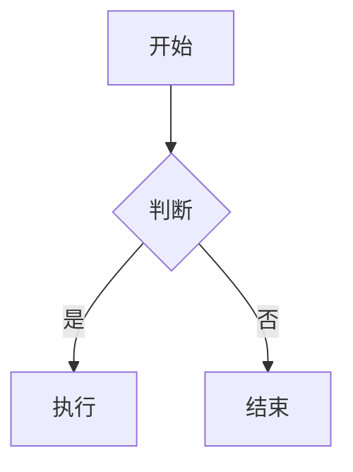

> 如果你刚接手一个半成品的 Astro 博客项目，对 Astro 一无所知，不知道从哪下手——这篇文章就是为你写的。不需要任何前端基础，只要会在电脑上装软件、敲命令行，就能跟着一步步把博客跑起来。

---

## 目录

1. [这个项目是什么](#1-这个项目是什么)
2. [你必须理解的四个核心概念](#2-你必须理解的四个核心概念)
3. [项目完成度一览](#3-项目完成度一览)
4. [环境准备](#4-环境准备)
5. [第一次运行](#5-第一次运行)
6. [第一个改动：把博客变成你自己的](#6-第一个改动把博客变成你自己的)
7. [如何写文章](#7-如何写文章)
8. [如何添加页面和导航栏](#8-如何添加页面和导航栏)
9. [深入理解：代码走读](#9-深入理解代码走读)
10. [常用命令速查表](#10-常用命令速查表)
11. [常见问题排查](#11-常见问题排查)
12. [改什么→找哪个文件（速查表）](#12-改什么找哪个文件速查表)
13. [部署到线上](#13-部署到线上)
14. [学习路线图](#14-学习路线图)

---

## 1. 这个项目是什么

### 1.1 用"印刷厂"来类比

把这个 Astro 博客想象成一家**印刷厂**，你的博客就是一本**杂志**：

- 你提供**文章**（Markdown 文件）和**设计模板**（Astro 组件）
- Astro 印刷厂把这些东西**印成一本静态的杂志**（纯 HTML 文件）
- 读者打开你的网站时，拿到的就是这本已经印好的杂志，**翻开就能看，不需要等待加载**

这和 React / Vue 这类框架有本质区别——那些更像是**把印刷机搬到读者家里**，让读者的浏览器自己现场印。Astro 则是**提前印好**，读者直接看成品。所以 Astro 网站通常**极快**。

### 1.2 技术组成（用房子类比）

| 技术 | 角色 | 类比 |
|------|------|------|
| **Astro 5** | 框架（骨架） | 房子的钢筋混凝土结构，决定房间怎么布局 |
| **Svelte 5** | 交互组件 | 房子里能"动"的东西：电灯开关、可拖拽的家具 |
| **Tailwind CSS 4** | 样式 | 房子的装修和配色 |
| **Markdown** | 文章格式 | 你用记事本写的内容 |

### 1.3 这个博客有什么功能

- 写文章（支持 Markdown、数学公式 KaTeX、流程图 Mermaid）
- 首页文章列表 + 分页（支持列表/网格两种布局）
- 归档、分类、标签
- 友链、关于、设备展示页面
- 番剧追踪、日记、相册、画廊
- 项目展示、技能展示、时间线
- 评论区（Twikoo，默认关闭）
- Live2D 看板娘猫娘（默认开启）
- 暗色/亮色主题切换 + 自定义主题色
- 中日英三语界面（基于 i18n 翻译系统）
- 页面切换动画（Swup 驱动，点链接不会闪白屏）
- RSS 订阅 + Atom 订阅 + 站点地图
- 文章密码保护 + 文章别名/自定义链接
- 樱花飘落特效（默认关闭）
- 全屏壁纸模式（可替代 Banner 模式）
- 图片灯箱（FancyApps UI）
- 代码块折叠 + 行号 + 自定义语言标签
- Banner 轮播 + 水波 SVG 效果
- 分享海报生成
- OG 图片自动生成（可选）

---

## 2. 你必须理解的四个核心概念

Astro 有四个核心概念。理解这四个，你就理解了 Astro 在做什么。下面每个概念都**结合这个项目的实际代码**来讲。

### 2.1 页面（Pages）——"杂志的每一页"

**一句话：** 浏览器地址栏里能访问到的每一个网址，都对应 `src/pages/` 下的一个文件。

**在这个项目里：**

```
src/pages/
├── [...page].astro          → 首页 /  以及  /page/2/  /page/3/  （分页列表）
├── [permalink].astro        → 自定义链接文章（启用 permalink 功能时使用）
├── posts/
│   └── [...slug].astro      → /posts/hello_world/  （每篇文章的详情页）
├── about.astro              → /about/
├── archive.astro            → /archive/
├── friends.astro            → /friends/
├── anime.astro              → /anime/
├── diary.astro              → /diary/
├── projects.astro           → /projects/
├── skills.astro             → /skills/
├── timeline.astro           → /timeline/
├── albums.astro             → /albums/
├── albums/[id]/index.astro  → /albums/相册名/  （相册详情页）
├── gallery.astro            → /gallery/
├── devices.astro            → /devices/
├── 404.astro                → 页面不存在时显示
├── rss.astro                → /rss/  （RSS 可视化页面）
├── atom.astro               → /atom.xml  （Atom 订阅源）
└── rss.xml.ts               → /rss.xml  （RSS 订阅源）
```

**规则：** 文件在 `pages/` 下的路径，去掉 `.astro` 后缀，就是网址。就像文件夹里放一个 `about.astro`，最后印出来就是 `/about/` 这一页。

**特殊文件名说明：**

- `[...page].astro` — 方括号 = "这个值是动态的"，`...` = "可以有多层路径"。用来生成首页 + 分页。
- `[permalink].astro` — 处理自定义固定链接，让文章可以在根目录下访问（如 `/my-post/`）。
- `posts/[...slug].astro` — `slug` 是文章的标识符，最终生成 `/posts/hello_world/`。
- `albums/[id]/index.astro` — `[id]` 是相册 ID，生成 `/albums/相册名/`。

### 2.2 布局（Layouts）——"杂志的版式模板"

**一句话：** 布局是页面的"外壳"。一本杂志每一页都有相同的页眉、页脚、侧边栏——布局就是把这些公共部分写好，每个页面只填中间的内容。

**在这个项目里：** 布局是**嵌套**关系，由外到内：

```
MainGridLayout.astro        ← 外层壳：导航栏 + Banner + 侧边栏 + 页脚
  └── Layout.astro          ← 内层壳：<html> <head> <body>、全局样式、Pio 看板娘、音乐播放器
        └── 具体页面内容    ← 通过 <slot /> 填入
```

> **注意：** 两个布局文件的嵌套方向和直觉可能相反——`MainGridLayout` 是"大框架"（导航栏、侧边栏、页脚都在这里），它内部引用了 `Layout`（HTML 文档头、全局脚本、看板娘等）。所以写页面时，直接使用 `MainGridLayout` 即可，不需要关心 `Layout`。

打开任意一个页面，比如 `about.astro`，你会看到这样的模式：

```astro
---
import MainGridLayout from "@layouts/MainGridLayout.astro";
---

<MainGridLayout title="关于" description="关于本站" lang="zh_CN">
  <!-- 这里面写的内容，会填入 MainGridLayout 的 <slot /> 位置 -->
  <main>
    <h1>关于本站</h1>
    <p>这里写自我介绍...</p>
  </main>
</MainGridLayout>
```

**`<slot />` 是什么？** 就是一个"洞"。布局文件挖好洞，每个页面把自己的内容往洞里填。Astro 会自动把洞里的内容组装到正确的位置。

### 2.3 组件（Components）——"杂志的可复用零件"

**一句话：** 组件是可以重复使用的 UI 零件。导航栏、文章卡片、分页按钮——这些东西在多个页面出现，做成组件后哪里需要就往哪里放。

**在这个项目里：** `src/components/` 下按功能分类：

```
src/components/
├── Navbar.astro              ← 顶部导航栏（每个页面都用）
├── Footer.astro              ← 底部页脚（每个页面都用）
├── PostCard.astro            ← 文章卡片（首页列表里每篇文章的样子）
├── PostMeta.astro            ← 文章元信息行（日期、标签、分类）
├── PostPage.astro            ← 文章列表容器
├── Encryptor.astro           ← 文章加密/解密组件
├── PasswordProtection.astro  ← 密码保护页面组件
├── GlobalStyles.astro        ← 全局样式注入
├── ConfigCarrier.astro       ← 配置数据桥接（将 Astro 配置传递给前端 JS）
├── CustomScrollbar.astro     ← Markdown 内 KaTeX 公式滚动条
├── TypewriterText.astro      ← 打字机效果组件
│
├── control/                  ← 控制类组件
│   ├── Pagination.astro      ← 分页按钮（上一页 / 下一页）
│   ├── BackToTop.astro       ← 返回顶部按钮
│   ├── ButtonLink.astro      ← 按钮样式链接
│   ├── ButtonTag.astro       ← 标签样式按钮
│   └── FloatingTOC.astro     ← 悬浮目录按钮
│
├── layout/                   ← 布局类组件
│   └── RightSideBar.astro    ← 右侧边栏布局管理器
│
├── widget/                   ← 侧边栏小部件
│   ├── Profile.astro         ← 个人资料卡片（头像、名字、社交链接）
│   ├── Announcement.astro    ← 公告面板
│   ├── Categories.astro      ← 分类列表
│   ├── Tags.astro            ← 标签云
│   ├── TOC.astro             ← 文章目录
│   ├── Calendar.astro        ← 日历（按日期高亮有文章的日子）
│   ├── SiteStats.astro       ← 站点统计
│   ├── SideBar.astro         ← 侧边栏容器
│   ├── RightSideBar.astro    ← 右侧栏容器
│   ├── WidgetLayout.astro    ← 小部件通用布局
│   ├── NavMenuPanel.astro    ← 移动端导航菜单面板
│   ├── DropdownMenu.astro    ← 下拉菜单组件
│   ├── DisplaySettings.svelte ← 显示设置面板（主题色、布局切换）
│   ├── ProjectCard.astro     ← 项目卡片
│   ├── SkillCard.astro       ← 技能卡片
│   ├── StatCard.astro        ← 统计数字卡片
│   └── TimelineItem.astro    ← 时间线条目
│
├── skills/                   ← 技能展示组件
│   └── SkillsChart.astro     ← 技能雷达图
│
├── comment/                  ← 评论系统
│   ├── index.astro           ← 评论统一入口（控制评论系统加载）
│   └── Twikoo.astro          ← Twikoo 评论组件
│
├── misc/                     ← 杂项组件
│   ├── Markdown.astro        ← Markdown 内容渲染器
│   ├── License.astro         ← 文章底部许可证声明
│   ├── Icon.astro            ← 图标组件
│   ├── IconifyLoader.astro   ← Iconify 图标加载器
│   ├── ImageWrapper.astro    ← 图片包装器（支持灯箱）
│   ├── FullscreenWallpaper.astro ← 全屏壁纸组件
│   ├── AnimationTest.astro   ← 动画测试组件
│   └── SharePoster.svelte    ← 分享海报生成（Svelte）
│
├── Search.svelte             ← 搜索面板（Svelte，Pagefind 驱动）
├── ArchivePanel.svelte       ← 归档页面搜索过滤面板（Svelte）
├── LayoutSwitchButton.svelte ← 文章列表布局切换按钮（Svelte）
├── LightDarkSwitch.svelte    ← 明暗主题切换开关（Svelte）
├── MobileTOC.svelte          ← 移动端悬浮目录（Svelte）
└── WallpaperSwitch.svelte    ← 壁纸模式切换按钮（Svelte）
```

**注意：** 大部分组件是 `.astro` 文件（静态的），但一些需要用户交互的组件是 `.svelte` 文件（动态的）。区分规则很简单：

- **只是展示内容** → `.astro`（印刷时就定死了，体积小、速度快）
- **需要点击、打字、拖拽** → `.svelte`（读者可以操作）

这就是 Astro 核心设计理念——**"岛屿架构"**：页面 99% 是静态 HTML，只有极少数需要交互的地方（"岛屿"）才加载 JavaScript。

### 2.4 内容集合（Content Collections）——"杂志的文章库"

**一句话：** 你只管往文件夹里丢 Markdown 文件，Astro 自动帮你整理、验证格式、提供查询接口。

**在这个项目里：** `src/content/` 下有两个集合：

```
src/content/
├── posts/             ← 博客文章集合
│   ├── hello_world.md
│   ├── MySQL整理/
│   │   └── index.md
│   └── astro-beginners-guide/
│       └── index.md
└── spec/              ← 特殊页面集合
    ├── about.md       ← 关于页面的内容
    └── friends.md     ← 友链页面的内容
```

内容集合的"规矩"定义在 `src/content.config.ts`（注意：**不是** `src/content/config.ts`，这是 Astro 5 的变化）：

```ts
// src/content.config.ts  — Astro 5 使用新的 content layer API
import { defineCollection } from "astro:content";
import { glob } from "astro/loaders";
import { z } from "astro/zod";

const postsCollection = defineCollection({
  // glob loader：从 src/content/posts/ 下加载所有 .md 文件
  loader: glob({ pattern: "**/*.md", base: "./src/content/posts" }),
  schema: z.object({
    title: z.string(),                           // 必须：文章标题
    published: z.date(),                         // 必须：发布日期
    description: z.string().optional().default(""),  // 可选：描述
    image: z.string().optional().default(""),    // 可选：封面图
    tags: z.array(z.string()).optional().default([]),  // 可选：标签
    category: z.string().optional().default(""), // 可选：分类
    draft: z.boolean().optional().default(false),// 可选：草稿
    pinned: z.boolean().optional().default(false),// 可选：置顶
    lang: z.string().optional().default(""),     // 可选：文章语言
    author: z.string().optional().default(""),   // 可选：作者名
    updated: z.date().optional(),                // 可选：更新日期
    encrypted: z.boolean().optional().default(false), // 可选：加密
    password: z.string().optional().default(""), // 可选：加密密码
    alias: z.string().optional(),                // 可选：文章别名
    permalink: z.string().optional(),            // 可选：自定义固定链接
    // ...更多字段见实际文件
  }),
});
```

**好处：** 如果你某篇文章忘了写 `title`，Astro 在构建时会直接报错告诉你，而不是悄悄生成一个坏页面。

**和旧版本的区别：** 在 Astro 4 及以前，内容配置放在 `src/content/config.ts`，使用 `type: 'content'` 加载器。Astro 5 引入了新的 **Content Layer** API，改用 `src/content.config.ts` + `glob` loader 的方式。如果你在网上搜到旧教程，注意分辨。

---

## 3. 项目完成度一览

下面是我逐项检查的结果。

### 3.1 核心功能

| 功能 | 状态 | 说明 |
|------|:--:|------|
| 首页文章列表 + 分页 | ✅ | `[...page].astro` + `PostCard` + `Pagination`，支持列表/网格两种布局 |
| 文章详情页 | ✅ | 支持加密、目录、许可证、封面图、前后篇导航、分享海报 |
| 导航栏（多级菜单） | ✅ | 桌面端下拉菜单 + 移动端抽屉，都可用 |
| 侧边栏（左/右双侧） | ✅ | Profile + 公告 + 分类 + 标签 + 站点统计 + 日历，可排序 |
| 明暗主题切换 | ✅ | 含色相选择器、自定义主题色 |
| 全文搜索 | ✅ | Pagefind 驱动，`Search.svelte` 面板 |
| 页面过渡动画 | ✅ | Swup 集成，点链接无白屏闪现 |
| 代码高亮 | ✅ | Expressive Code + 自定义语言标签、复制按钮、折叠、行号 |
| Markdown 扩展 | ✅ | KaTeX 数学公式 + Mermaid 流程图 + Admonition 提示框 + GitHub 卡片 |
| RSS + Atom 订阅 | ✅ | `/rss.xml` + `/atom.xml` + `/rss/` 可视化页面 |
| 站点地图 | ✅ | `@astrojs/sitemap` 自动生成 |
| Banner 轮播 + 水波效果 | ✅ | 桌面/移动端独立图片轮播，打字机副标题，水波 SVG |
| 国际化（中/英/日） | ✅ | 界面文本已翻译三种语言 |
| Live2D 看板娘 | ✅ | Pio 猫娘可拖拽、有对话、有触摸反馈 |
| 归档页面（搜索过滤） | ✅ | `ArchivePanel.svelte` 支持关键词过滤 |
| 404 页面 | ✅ | 自定义 404 |
| 全屏壁纸模式 | ✅ | 可切换 Banner / 全屏壁纸 / 无壁纸三种模式 |
| 图片灯箱 | ✅ | FancyApps UI 集成，支持相册、文章内图片浏览 |
| 分享海报生成 | ✅ | 支持生成文章分享海报 |
| 文章自定义链接 | ✅ | 支持 `alias` 别名和 `permalink` 自定义固定链接 |

### 3.2 内容相关

| 功能 | 状态 | 说明 |
|------|:--:|------|
| 博客文章 | ✅ | 有约 10 篇学习笔记文章 |
| 关于页面 | ⚠️ | 内容描述的是原主题特性，**你需要改成你自己的介绍** |
| 友链页面 | ⚠️ | `data/friends.ts` 已配置了少量友链，但 `spec/friends.md` 内容为空 |

### 3.3 数据展示页面

| 功能 | 状态 | 说明 |
|------|:--:|------|
| 项目展示（`/projects/`） | ⚠️ | `data/projects.ts` 已有示例数据，但需要替换为你的项目 |
| 技能展示（`/skills/`） | ⚠️ | `data/skills.ts` 已有示例数据，但需要补充更多技能 |
| 时间线（`/timeline/`） | ⚠️ | `data/timeline.ts` 已有示例数据，需要改为你的经历 |
| 番剧追踪（`/anime/`） | ⚠️ | `data/anime.ts` 可从 Bangumi/B站 获取数据，需配置 |
| 设备展示（`/devices/`） | ⚠️ | `data/devices.ts` 需要补充你的设备信息 |
| 日记（`/diary/`） | ⚠️ | `data/diary.ts` 需要填充内容 |
| 相册（`/albums/`） | ⚠️ | 页面完整，但 `public/images/albums/` 需要填充图片 |
| 画廊（`/gallery/`） | ⚠️ | 页面完整，但图片需来自相册 |

### 3.4 可选功能（默认关闭，需要配置才能用）

| 功能 | 状态 | 说明 |
|------|:--:|------|
| 评论区 | ⚠️ | Twikoo 组件已集成，默认关闭，需填写 `envId` |
| 自定义页脚 | ⚠️ | `footerConfig.enable = false` |
| OG 图片自动生成 | ⚠️ | 默认关闭，开启后构建很慢 |
| Bangumi 番剧数据同步 | ⚠️ | 需配置 `bangumi.userId`，默认关闭 |

### 3.5 总结

这个项目**架子上已经搭好了大部分**。核心功能（首页、文章、导航、搜索、主题切换）全部就绪，数据页面也已有示例数据。

**你可以立刻做的事：** 改配置、写文章，博客就能用。

**需要花时间填的坑：** 数据页面（projects, skills, timeline 等）的示例数据需要替换为你自己的。

---

## 4. 环境准备

### 4.1 Node.js（必须）

Node.js 是 JavaScript 的运行环境。这个项目需要它。

1. 打开 [https://nodejs.org](https://nodejs.org)
2. 下载 **LTS 版本**（长期支持版），版本 ≥ 18
3. 双击安装，一路点"下一步"
4. 打开终端（命令行），验证：

```bash
node -v
# 应该输出类似 v20.11.0

npm -v
# 应该输出类似 10.2.4
```

### 4.2 pnpm（必须）

这个项目用 pnpm 作为包管理器，不能用 npm 或 yarn。

```bash
# 全局安装 pnpm（只需执行一次）
npm install -g pnpm

# 验证
pnpm -v
# 应该输出类似 10.22.0
```

> **为什么必须用 pnpm？** `package.json` 里写死了 `"packageManager": "pnpm@10.22.0"`，用 npm 会直接报错拒绝运行。

### 4.3 Git（推荐）

用于版本管理。如果要托管到 GitHub，就需要它。

- 下载：[https://git-scm.com](https://git-scm.com)
- 验证：`git --version`

### 4.4 代码编辑器（推荐 VS Code）

- 下载：[https://code.visualstudio.com](https://code.visualstudio.com)
- 推荐安装插件：**Astro**（官方插件，语法高亮 + 自动补全）

---

## 5. 第一次运行

### 5.1 三步启动

打开终端，`cd` 到项目根目录（包含 `package.json` 的文件夹），依次执行：

```bash
# 第一步：安装依赖（只需运行一次，以后不用重复）
pnpm install

# 第二步：同步内容仓库（从 Git 子模块拉取文章数据）
pnpm sync-content

# 第三步：启动开发服务器
pnpm dev
```

成功的话会显示：

```
┃ Local    http://localhost:4321/
```

在浏览器打开 `http://localhost:4321/`，你应该看到博客首页了。

### 5.2 开发服务器的特点

- 改代码后**浏览器自动刷新**，不需要手动 F5
- 只在你的电脑上运行，别人看不到
- 按 `Ctrl + C` 停止

### 5.3 如果报错了

把**终端的完整报错信息**复制下来。常见情况：

| 报错关键字 | 可能原因 | 自己可以先试 |
|-----------|---------|------------|
| `pnpm: command not found` | 没装 pnpm | `npm install -g pnpm` |
| `node: command not found` | 没装 Node.js | 去 nodejs.org 下载安装 |
| `Cannot find module` | 依赖没装全 | 删掉 `node_modules/`，重跑 `pnpm install` |
| `port 4321 is already in use` | 端口被占用 | `pnpm dev --port 3000` 换端口 |
| `Only pnpm is allowed` | 用了 npm 命令 | 换成 `pnpm` 开头 |
| `sync-content` 报错 | 内容子模块未初始化 | `git submodule update --init` |

### 5.4 开发小技巧

- 改完代码不需要手动刷新浏览器，Astro 会自动热更新
- `draft: true` 的文章在 `pnpm dev` 下可见，`pnpm build` 后自动隐藏
- 改 `src/config.ts` 后偶尔需要手动刷新（配置变更不一定触发热更新）

---

## 6. 第一个改动：把博客变成你自己的

打开 `src/config.ts`，这是博客的**总控制面板**。下面按区块说明。

### 6.1 网站标题和副标题

找到 `siteConfig` 对象（约第 25 行）：

```ts
export const siteConfig: SiteConfig = {
  title: "奇奇莫拉の日记本",       // ← 浏览器标签页标题
  subtitle: "私人小网站",           // ← 主页副标题

  themeColor: {
    hue: 185,       // 色相值 0~360（0=红, 120=绿, 240=蓝, 185=青）
    fixed: false,   // true = 禁止访客切换颜色
  },
  // ...
```

### 6.2 网站 URL 和时区

```ts
  siteURL: "https://qiqimora.cn/",   // ← 改成你的域名
  siteStartDate: "2025-08-31",       // ← 站点开始运行的日期
  timeZone: 8,                       // ← 时区，UTC+8 北京时间
  lang: "zh_CN",                     // ← 默认语言
```

### 6.3 特色页面开关

```ts
  featurePages: {
    anime: true,     // 番剧页面
    diary: true,     // 日记页面
    friends: true,   // 友链页面
    projects: true,  // 项目页面
    skills: true,    // 技能页面
    timeline: true,  // 时间线页面
    albums: true,    // 相册页面
    devices: true,   // 设备页面
  },
```

关闭不用的页面可以提升 SEO，关闭后记得在导航栏配置中移除对应链接。

### 6.4 导航栏标题和 Logo

```ts
  navbarTitle: {
    mode: "logo",          // "text-icon" 显示图标+文本，"logo" 仅显示Logo
    text: "MizukiUI",      // 顶栏标题文本
    icon: "assets/home/home.png",  // 顶栏图标路径
    logo: "assets/home/default-logo.png",  // Logo 图片路径
  },
```

### 6.5 Banner 文字（首页顶部大图上的字）

```ts
  banner: {                      // ← homeText 在 banner 对象下面！
    // ...（图片配置等）
    homeText: {
      enable: true,
      title: "奇奇莫拉の日记",       // ← 首页大标题
      subtitle: [                   // ← 副标题（支持多条轮播）
        "虽然没有什么特别的事，但只要有你在就足够了。",
        "如今你依然是我的光。",
        "你啊，不知不觉间就成了我生活的日常。",
        // ...
      ],
      typewriter: {
        enable: true,     // 打字机效果开关
        speed: 100,       // 打字速度（毫秒）
      },
    },
  },
```

### 6.6 Banner 图片

找到 `siteConfig.banner.src`：

```ts
  banner: {
    src: {
      desktop: [
        "/assets/desktop-banner/1.webp",
        // ...
      ],
      mobile: [
        "/assets/mobile-banner/1.webp",
        // ...
      ],
    },
    position: "center",   // 图片定位：top / center / bottom
    carousel: {
      enable: true,       // 轮播开关
      interval: 4,        // 轮播间隔（秒）
    },
    waves: {
      enable: true,       // 水波效果（性能开销较大）
    },
  },
```

图片存放在 `public/assets/desktop-banner/` 和 `public/assets/mobile-banner/` 下。

### 6.7 头像和名字

找到 `profileConfig`（约第 373 行）：

```ts
export const profileConfig: ProfileConfig = {
  avatar: "assets/images/avatar.webp",  // 头像路径（相对于/src）
  name: "キキモラ-奇奇莫拉",             // 你的名字（显示在侧边栏）
  bio: "咱是奇奇莫拉，喜欢看番、画画、写日记",  // 个人简介
  typewriter: {
    enable: true,       // 简介打字机效果
    speed: 80,
  },
  links: [                              // 社交链接
    {
      name: "Bilibili",
      icon: "fa7-brands:bilibili",     // ← 注意是 fa7 不是 fa6
      url: "https://space.bilibili.com/你的ID",
    },
    {
      name: "GitHub",
      icon: "fa7-brands:github",
      url: "https://github.com/你的用户名",
    },
  ],
};
```

> 图标名称可以在 [Iconify](https://icon-sets.iconify.design/) 网站上搜索。注意项目中用的是 `fa7-brands`（Font Awesome 7）前缀。

### 6.8 目录配置

```ts
  toc: {
    enable: true,               // 启用目录
    mode: "sidebar",            // "float" 悬浮按钮 | "sidebar" 侧边栏
    depth: 2,                   // 目录深度（2=显示 h1 和 h2）
    useJapaneseBadge: true,     // 使用日语假名标记
  },
```

### 6.9 侧边栏组件

```ts
export const sidebarLayoutConfig: SidebarLayoutConfig = {
  properties: [
    { type: "profile", position: "top" },      // 个人资料
    { type: "announcement", position: "top" },  // 公告
    { type: "categories", position: "sticky" }, // 分类
    { type: "tags", position: "top" },          // 标签
    { type: "site-stats", position: "top" },    // 站点统计
    { type: "calendar", position: "top" },      // 日历
  ],
  components: {
    left: ["profile", "announcement", "categories", "tags"],
    right: ["site-stats", "calendar"],
  },
};
```

### 6.10 开关不需要的功能

```ts
// 关评论
export const commentConfig = { enable: false };

// 关音乐
export const musicPlayerConfig = { enable: false };

// 关樱花（默认已关）
export const sakuraConfig = { enable: false };

// 关看板娘猫娘（默认开启）
export const pioConfig = { enable: false };

// 关分享
export const shareConfig = { enable: false };

// 关自定义页脚
export const footerConfig = { enable: false };
```

### 6.11 字体配置

```ts
  font: {
    asciiFont: {
      fontFamily: "Consola",             // 英文字体
      enableCompress: true,              // 字体子集优化
    },
    cjkFont: {
      fontFamily: "LXGWWenKaiMono-Regular.ttf",  // 中日韩字体
      enableCompress: true,
    },
  },
```

---

## 7. 如何写文章

### 7.1 方法一：用命令创建（推荐）

```bash
pnpm new-post 我的第一篇文章
```

这会在 `src/content/posts/` 下创建 `我的第一篇文章.md`，填入 frontmatter 模板。

### 7.2 方法二：手动创建

在 `src/content/posts/` 下新建 `.md` 文件，粘贴：

```markdown
---
title: 我的第一篇文章
published: 2026-05-28
description: 文章摘要，会显示在首页卡片上
image: ''
tags: [标签1, 标签2]
category: 分类名
draft: false
pinned: false
lang: zh_CN
---

在这里写文章正文，支持 Markdown 语法。

## 二级标题

普通文字。**加粗**，*斜体*。

- 列表
- 列表

> 引用

​```python
print("代码块")
​```
```

### 7.3 Frontmatter 字段说明

文章顶部 `---` 之间的内容叫 **frontmatter**（前置元数据）：

| 字段 | 必填 | 说明 | 示例 |
|------|:--:|------|------|
| `title` | 是 | 文章标题 | `"我的第一篇文章"` |
| `published` | 是 | 发布日期 | `2026-05-28` |
| `description` | 推荐 | 摘要，显示在卡片上 | `"这篇文章讲了..."` |
| `tags` | 否 | 标签列表 | `[前端, Astro]` |
| `category` | 否 | 分类 | `"技术笔记"` |
| `image` | 否 | 封面图路径 | `"cover.webp"` |
| `draft` | 否 | 草稿（`true` = 生产环境不显示） | `false` |
| `pinned` | 否 | 置顶（排在前面） | `false` |
| `lang` | 否 | 文章语言 | `zh_CN` |
| `author` | 否 | 作者（默认用配置里的名字） | `"你的名字"` |
| `updated` | 否 | 最后更新日期 | `2026-06-01` |
| `encrypted` | 否 | 加密文章（配合 `password` 使用） | `false` |
| `password` | 否 | 加密密码 | `"123456"` |
| `alias` | 否 | 文章别名，可生成额外路径 | `"my-post"` |
| `permalink` | 否 | 自定义固定链接（优先级高于 alias） | `"custom-page"` |

### 7.4 文章文件组织方式

**方式一：单文件**（适合纯文字文章）

```
src/content/posts/
└── 我的文章.md
```

**方式二：文件夹**（适合包含图片的文章）

```
src/content/posts/
└── 我的文章/
    ├── index.md       ← 必须叫 index.md
    ├── cover.png      ← 封面图
    └── diagram.png    ← 文内插图
```

> 文件夹模式下，文中引用图片直接写文件名：``

### 7.5 特殊语法（Markdown 扩展）

这个项目内置了丰富的扩展语法：

**数学公式（KaTeX）：**

```markdown
行内公式：$E = mc^2$

块级公式：
$$
\int_0^\infty e^{-x^2} dx = \frac{\sqrt{\pi}}{2}
$$
```

**流程图（Mermaid）：**

````markdown

````

**提示框（Admonition）：**

```markdown
:::note
这是一条普通提示
:::

:::tip
这是一条小技巧
:::

:::warning
这是一条警告
:::

:::caution
需要注意的事项
:::

:::important
重要信息
:::
```

**GitHub 仓库卡片：**

```markdown
::github{repo="belgnas/belgnas.github.io"}
```

---

## 8. 如何添加页面和导航栏

### 8.1 添加一个新页面

假设你想加一个 `/links/` 友链汇总页面。在 `src/pages/` 下新建 `links.astro`：

```astro
---
import MainGridLayout from "@layouts/MainGridLayout.astro";
---

<MainGridLayout title="友链" description="小伙伴们" lang="zh_CN">
  <main>
    <h1>友链</h1>
    <p>这里放你的友链内容</p>
  </main>
</MainGridLayout>
```

**路由规则：**

| 文件路径 | 对应网址 |
|----------|----------|
| `src/pages/index.astro` | `/` |
| `src/pages/about.astro` | `/about/` |
| `src/pages/links.astro` | `/links/` |
| `src/pages/posts/[...slug].astro` | `/posts/文章名/` |

规律：文件路径（去掉前缀 `src/pages/` 和后缀 `.astro`）= 网址路径。

### 8.2 把新页面加入导航栏

在 `src/config.ts` 的 `navBarConfig.links` 中添加：

```ts
export const navBarConfig: NavBarConfig = {
  links: [
    LinkPreset.Home,          // 预设：首页
    LinkPreset.Archive,       // 预设：归档
    {
      name: "友链",           // 导航栏显示的文字
      url: "/links/",         // 页面地址
      icon: "material-symbols:link",  // 图标（可选，在 Iconify 搜）
    },
  ],
};
```

### 8.3 导航栏支持多级菜单

```ts
{
  name: "链接",
  url: "/links/",
  children: [                   // 子菜单
    {
      name: "GitHub",
      url: "https://github.com/...",
      external: true,           // external = 外部链接，新标签页打开
      icon: "fa7-brands:github",
    },
  ],
},
```

### 8.4 可用的预设链接（LinkPreset）

| 预设 | 对应 |
|------|------|
| `LinkPreset.Home` | 首页 |
| `LinkPreset.Archive` | 归档 |
| `LinkPreset.About` | 关于 |
| `LinkPreset.Friends` | 友链 |
| `LinkPreset.Anime` | 番剧追踪 |
| `LinkPreset.Diary` | 日记 |
| `LinkPreset.Projects` | 项目 |
| `LinkPreset.Skills` | 技能 |
| `LinkPreset.Timeline` | 时间线 |

---

## 9. 深入理解：代码走读

> 这一节是进阶内容。如果你刚上手，可以跳过，先改配置和写文章。当你想理解"这个页面到底是怎么生成出来的"时，再回来看。

### 9.1 首页是怎么工作的？（`[...page].astro`）

这个项目**没有** `index.astro`。首页由 `[...page].astro` 承担，因为它还需要处理分页。

```astro
---
// ╔══════════════════════════════════╗
// ║  上半部分：JavaScript 逻辑      ║
// ╚══════════════════════════════════╝

import type { GetStaticPaths } from "astro";
import Pagination from "../components/control/Pagination.astro";
import PostPage from "../components/PostPage.astro";
import { PAGE_SIZE } from "../constants/constants";
import MainGridLayout from "../layouts/MainGridLayout.astro";
import { getSortedPosts } from "../utils/content-utils";

// export const getStaticPaths — 注意是 export const 而不是 export async function
// 这是 Astro 5 中推荐的写法，使用 satisfies 关键字
export const getStaticPaths = (async ({ paginate }) => {
  const allPosts = await getSortedPosts();    // 获取所有文章
  return paginate(allPosts, { pageSize: PAGE_SIZE }); // 每 8 篇分一页（PAGE_SIZE=8）
}) satisfies GetStaticPaths;

// Astro 自动把当前页的数据放到 Astro.props.page 里
const { page } = Astro.props;
---

<!-- ╔══════════════════════════════════╗ -->
<!-- ║  下半部分：HTML 模板            ║ -->
<!-- ╚══════════════════════════════════╝ -->

<MainGridLayout>
  <PostPage page={page} />     <!-- 当前页的文章列表 -->
  <Pagination page={page} />   <!-- 上一页 / 下一页按钮 -->
</MainGridLayout>
```

**`getStaticPaths` 用人话解释：**

它回答一个问题："你要印哪几页？"

假设你有 20 篇文章，每页 8 篇：
- 第 1 页（`/`）→ 文章 1~8
- 第 2 页（`/page/2/`）→ 文章 9~16
- 第 3 页（`/page/3/`）→ 文章 17~20

`paginate()` 帮你自动算好这些，你只需要告诉它"每页多少篇"。

### 9.2 文章详情页是怎么工作的？（`posts/[...slug].astro`）

```astro
---
// 为每一篇文章生成一个 URL
export async function getStaticPaths() {
  const posts = await getSortedPosts();
  return posts.map((post) => ({
    params: { slug: post.slug },    // 比如 slug = "hello_world"
    props: { entry: post },         // 把整篇文章数据传给模板
  }));
}

// 拿到当前文章的 entry
const { entry } = Astro.props;
// render() 把 Markdown 变成 HTML
const { Content, headings } = await render(entry);
// 还可以获取 remark 插件处理后的 frontmatter
const { remarkPluginFrontmatter } = await render(entry);
---

<MainGridLayout title={entry.data.title}>
  <article>
    <h1>{entry.data.title}</h1>
    <PostMeta post={entry} />       <!-- 日期、标签、分类 -->
    <Markdown>
      <Content />                   <!-- 文章正文（Markdown 已渲染为 HTML）-->
    </Markdown>
  </article>
</MainGridLayout>
```

**数据流（追踪一篇文章从文件到页面的全过程）：**

```
1. 你写 hello_world.md
      ↓
2. getSortedPosts() 读取它，提取 frontmatter + 正文
      ↓
3. getStaticPaths() 生成路由 /posts/hello_world/
      ↓
4. 用户访问这个 URL
      ↓
5. entry.render() 把 Markdown 转换成 HTML
      ↓
6. <Content /> 组件 + <Markdown> 包装器 把 HTML 插入页面模板
      ↓
7. 读者看到完整的文章页面
```

### 9.3 Astro 文件的两段式结构

所有 `.astro` 文件都遵循这个模式：

```astro
---
// 上半部分（frontmatter script）
// 写 JavaScript / TypeScript 逻辑
// 在构建时运行（服务器端）
// 可以 import 其他文件、调用 API、处理数据
const name = "qiqimora";
const posts = await getSortedPosts();
---

<!-- 下半部分（template）-->
<!-- 写 HTML 模板 -->
<!-- { } 里面可以嵌入 JS 表达式 -->
<h1>你好，{name}！</h1>
<p>共有 {posts.length} 篇文章</p>
```

**关键规则：**
- `---` 之间是**构建时**运行的，生成的是数据，不会发送到浏览器
- `---` 下面是**模板**，会被编译成 HTML 发送到浏览器
- 模板里 `{ }` 可以嵌入 JS 表达式，但不支持 `if` / `for` 等语句（那些需要用 Astro 的模板语法）

### 9.4 数据页面是怎么填数据的？

以 `/projects/` 为例。页面文件 `projects.astro` 本身是完整的，但它从 `src/data/projects.ts` 拿数据：

```ts
// src/data/projects.ts
export interface Project {
  id: string;
  title: string;
  description: string;
  image: string;
  category: "web" | "mobile" | "desktop" | "other";
  techStack: string[];
  status: "completed" | "in-progress" | "planned";
  liveDemo?: string;
  sourceCode?: string;
  startDate: string;
  endDate?: string;
  featured?: boolean;
  tags?: string[];
}
```

**改法：** 打开 `src/data/projects.ts`，添加或修改你的项目数据：

```ts
export const projectsData: Project[] = [
  {
    id: "my-project",
    title: "我的第一个项目",
    description: "这是一个xxx项目，用来解决xxx问题",
    image: "/images/projects/project1.png",
    category: "web",
    techStack: ["Astro", "Tailwind", "Svelte"],
    status: "completed",
    liveDemo: "https://你的项目地址",
    sourceCode: "https://github.com/你的用户名/项目名",
    startDate: "2025-01",
    endDate: "2025-03",
    featured: true,
    tags: ["前端", "博客"],
  },
];
```

> **其他数据文件同理：**
> - 技能 → `src/data/skills.ts`
> - 时间线 → `src/data/timeline.ts`
> - 设备 → `src/data/devices.ts`
> - 友链 → `src/data/friends.ts`

---

## 10. 常用命令速查表

在项目根目录下执行：

```bash
# 启动开发服务器（边改边看，浏览器自动刷新）
pnpm dev

# 构建生产版本（生成最终 HTML 到 dist/ 目录）
pnpm build

# 预览生产版本（先 build，再本地预览产物）
pnpm build && pnpm preview

# 创建新文章
pnpm new-post 文章标题

# Astro 类型检查（检查 Astro 文件类型错误）
pnpm check

# TypeScript 类型检查
pnpm type-check

# 代码格式化
pnpm format

# 代码检查 + 自动修复
pnpm lint

# 同步内容仓库（拉取最新文章数据）
pnpm sync-content

# 更新番剧数据（从 Bangumi API）
pnpm update-bangumi

# 更新番剧数据（从 Bilibili API）
pnpm update-bilibili
```

---

## 11. 常见问题排查

### 11.1 `pnpm install` 失败

```bash
# 确认 pnpm 已安装
pnpm -v

# 如果没装
npm install -g pnpm

# 如果还是失败，清理后重试
rm -rf node_modules pnpm-lock.yaml
pnpm install
```

### 11.2 `pnpm dev` 启动后浏览器白屏

1. **端口被占用**：`pnpm dev --port 3000` 换端口
2. **依赖没装全**：删 `node_modules/`，重跑 `pnpm install`
3. **浏览器缓存**：`Ctrl + Shift + R` 强制刷新

### 11.3 文章改了但网站上看不到

1. `draft` 是不是 `true`？（草稿模式下 `pnpm build` 不输出，但 `pnpm dev` 可见）
2. 文件保存了吗？
3. 终端有报错吗？
4. 试试停掉服务器（`Ctrl + C`）再 `pnpm dev`

### 11.4 Markdown 语法没渲染

- Mermaid 需要三个反引号 + `mermaid`：`` ```mermaid ``
- 提示框 `:::note` 后要换行，结束时 `:::` 单独一行
- KaTeX 公式前后不要有多余空格

### 11.5 图片显示不出来

- 放在文章文件夹里的图：直接写文件名 ``
- 放在 `public/` 下的图：路径以 `/` 开头 `/images/xxx.jpg`
- 大小写！Windows 不区分大小写，但部署到 Linux 服务器后 `Cover.png` ≠ `cover.png`

### 11.6 构建失败

```bash
# 先做类型检查
pnpm check

# 清理缓存
rm -rf dist .astro
pnpm build
```

---

## 12. 改什么→找哪个文件（速查表）

| 你想做的事 | 文件 / 位置 |
|------------|-------------|
| 改网站标题 | `src/config.ts` → `siteConfig.title` |
| 改网站 URL | `src/config.ts` → `siteConfig.siteURL` |
| 改头像 | `src/config.ts` → `profileConfig.avatar` |
| 改名字（侧边栏） | `src/config.ts` → `profileConfig.name` |
| 改简介 | `src/config.ts` → `profileConfig.bio` |
| 改 Banner 图 | `public/assets/desktop-banner/` 换图 + 改 `src/config.ts` |
| 改首页大标题 | `src/config.ts` → `siteConfig.banner.homeText.title` |
| 改主题色 | `src/config.ts` → `siteConfig.themeColor.hue` |
| 改导航栏菜单 | `src/config.ts` → `navBarConfig.links` |
| 改侧边栏显示什么 | `src/config.ts` → `sidebarLayoutConfig.components` |
| 改社交链接 | `src/config.ts` → `profileConfig.links` |
| 开关评论区 | `src/config.ts` → `commentConfig.enable` |
| 开关猫娘看板娘 | `src/config.ts` → `pioConfig.enable` |
| 开关音乐播放器 | `src/config.ts` → `musicPlayerConfig.enable` |
| 开关樱花特效 | `src/config.ts` → `sakuraConfig.enable` |
| 开关分享功能 | `src/config.ts` → `shareConfig.enable` |
| 开关 Banner | `src/config.ts` → `siteConfig.banner.src` |
| 切换壁纸模式（banner/全屏/无） | `src/config.ts` → `siteConfig.wallpaperMode.defaultMode` |
| 写新文章 | `src/content/posts/` 下新建 `.md` 文件 |
| 添加新页面 | `src/pages/` 下新建 `.astro` 文件 |
| 改"关于"页内容 | `src/content/spec/about.md` |
| 改"友链"页内容 | `src/data/friends.ts` 或 `src/content/spec/friends.md` |
| 添加项目 | `src/data/projects.ts` |
| 添加技能 | `src/data/skills.ts` |
| 添加时间线 | `src/data/timeline.ts` |
| 添加设备 | `src/data/devices.ts` |
| 改多语言翻译 | `src/i18n/languages/` 下的对应文件（`en.ts` / `ja.ts` / `zh_CN.ts` / `zh_TW.ts`） |
| 改全局样式 | `src/styles/main.css` |
| 改 Markdown 样式 | `src/styles/markdown.css` |
| 换 favicon 图标 | `public/favicon/` 目录 |
| 添加音乐 | `public/assets/music/` 目录 |
| 添加相册 | `public/images/albums/` 下新建文件夹 |
| 改看板娘对话 | `src/config.ts` → `pioConfig.dialog` |
| 改字体配置 | `src/config.ts` → `siteConfig.font` |
| 改目录配置 | `src/config.ts` → `siteConfig.toc` |

---

## 13. 部署到线上

### 13.1 GitHub Pages（免费）

项目已配好 GitHub Actions（`.github/workflows/deploy.yml`）：

1. 把代码推送到 GitHub 仓库
2. 仓库 **Settings → Pages** → Source 选 **GitHub Actions**
3. 每次推送代码，GitHub 自动构建并部署

### 13.2 Vercel（免费，更推荐）

1. 注册 [vercel.com](https://vercel.com)（用 GitHub 登录）
2. **New Project** → 导入你的 GitHub 仓库
3. Vercel 自动识别 Astro 项目，无需额外配置
4. 点 **Deploy**，获得 `xxx.vercel.app` 域名

### 13.3 构建产物

`pnpm build` 后，静态文件在 `dist/` 目录下。部署时上传的就是这个目录的内容。

---

## 14. 学习路线图

按这个顺序学，边学边在项目上动手：

### 第 0 步（5 分钟）：跑起来

```bash
pnpm install
pnpm dev
```

打开 `http://localhost:4321/`，看到博客 = 成功。

### 第 1 步（30 分钟）：纯改配置，不动代码

**目标：** 熟悉 `src/config.ts`。你改一个字，网站就变一个样，即时的正反馈是最好的学习方式。

**练习：**
1. 把 `siteConfig.title`、`profileConfig.name`、`bio` 全改成你的
2. 把 `themeColor.hue` 改成 200（看看蓝色的效果）
3. 打开/关闭几个功能开关
4. 换掉社交链接

### 第 2 步（1 小时）：写文章

**目标：** 理解 Content Collections。

**练习：**
1. `pnpm new-post 测试` 创建一篇，看它自动生成的 frontmatter 模板
2. 手工创建一篇，把 frontmatter 所有字段都试一试
3. 试一下 KaTeX 公式、Mermaid 流程图、Admonition 提示框的语法

### 第 3 步（1 小时）：看懂首页和文章页

**目标：** 理解 `getStaticPaths` 和动态路由。

**要看的文件：**
1. `src/pages/[...page].astro` — 首页分页怎么做的
2. `src/pages/posts/[...slug].astro` — 每篇文章的页面怎么生成的
3. `src/utils/content-utils.ts` — `getSortedPosts()` 返回了什么

详细讲解见[第 9 节](#9-深入理解代码走读)。

### 第 4 步（2 小时）：填数据

**目标：** 把示例数据替换成你自己的。

**要改的文件：**
1. `src/data/projects.ts` — 替换示例项目
2. `src/data/skills.ts` — 替换示例技能
3. `src/data/timeline.ts` — 替换示例时间线
4. `src/data/friends.ts` — 添加友链
5. `src/content/spec/about.md` — 写你的自我介绍

### 第 5 步（后续）：深入

- 学 [Astro 官方教程](https://docs.astro.build/zh-cn/) 的"组件"章节，理解 props
- 学 [Tailwind CSS](https://tailwindcss.com/docs) 基础，开始改样式
- 学 [Svelte 官方教程](https://svelte.dev/tutorial) 基础，理解交互组件
- 动手添加一个全新的页面（比如 `/bookshelf/` 书架页面）

---

## 附录 A：文件后缀速查

| 后缀 | 是什么 | 在哪里出现 |
|------|--------|-----------|
| `.astro` | Astro 组件/页面 | `src/pages/`, `src/components/`, `src/layouts/` |
| `.svelte` | Svelte 交互组件 | `src/components/`（搜索、音乐、看板娘等） |
| `.md` | Markdown 文章 | `src/content/posts/`, `src/content/spec/` |
| `.ts` | TypeScript 代码 | `src/config.ts`, `src/utils/`, `src/data/` |
| `.css` | 样式表 | `src/styles/` |
| `.mjs` | ES Module JS | `src/plugins/`, `astro.config.mjs` |
| `.json` | JSON 配置 | `package.json`, `tsconfig.json` |

## 附录 B：重要外部链接

- [Astro 官方文档](https://docs.astro.build/) / [中文版](https://docs.astro.build/zh-cn/)
- [Svelte 交互式教程](https://svelte.dev/tutorial)
- [Tailwind CSS 文档](https://tailwindcss.com/docs)
- [Markdown 语法指南](https://www.markdownguide.org/)
- [Iconify 图标搜索](https://icon-sets.iconify.design/)
- [Mermaid 流程图语法](https://mermaid.js.org/)
- [KaTeX 数学公式语法](https://katex.org/docs/supported.html)
