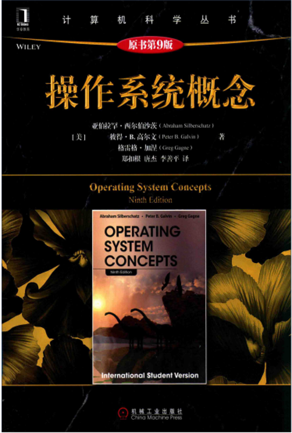

# 概论
- 操作系统（**Operating System，OS**）位于计算机用户与计算机**硬件**之间。
- 操作系统的目的是提供环境，以便用户能够便捷而高效地执行程序。
- 操作系统是**管理计算机硬件**的程序。它还为应用程序提供基础，并充当计算机用户和硬件的中介。
- 大型机的操作系统主要用于**优化硬件使用率**。
- 个人计算机（PC）的操作系统支持复杂游戏、商业应用和这两者之间的其他应- 用。
- 操作系统**既庞大又复杂**。

## 操作系统的功能
- 计算机系统可以分为4个组件：硬件、操作系统、应用程序、用户。
  - 硬件：如中央处理单元（cpu）、内存、输入/输出设备，为系统提供基本的计算机资源。
  - 操作系统控制硬件，并协调各个用户应用程序的硬件使用。
  - 计算机系统可以分为硬件、软件及数据。当计算机系统运行时，操作系统正确手段以便使用这些资源。
- 操作系统类似于政府，其本身不能实现任何有用功能，而是提供一个方便其他程序执行有用工作的环境。
<br>

- 用户视角
  - 计算机的用户视角因使用界面不同而不同。
  - **PC用户**：操作系统设计的主要目的是用户使用方便、次要的是性能，不在乎的资源利用。
  - 大型机或小型机用户：操作系统的设计目标是优化资源利用率，确保所有的cpu时间、内存和I/O都能得到有效使用，并且确保没有用户使用超过限额以外的资源。
  - 工作站用户：工作站与其他工作站和服务器相连。操作系统的设计需要兼顾使用方便性和资源利用率。
  - 智能手机和平板电脑等**移动计算机用户**：大多数移动计算机为单用户使用，用户通过触摸屏来交互。
  - 嵌入式设备：家电和汽车等嵌入式计算机。
- 系统视角
  - 从计算机角度来看，操作系统是与硬件紧密相连的程序。可将操作系统看作**资源分配器**。
  - 计算机系统可能具有许多资源：cpu时间、内存空间、文件存储空间、I/O设备等。操作系统管理这些资源。面对许多甚至冲突的资源请求，操作系统应考虑如何为各个程序和用户分配资源，以便计算机系统能有效且公平地运行。
<br>

- 操作系统的定义
  - 一般来说，没有一个关于操作系统的完全准确的定义。
  - 操作系统的存在是因为提供了合理方式解决创建可用计算系统的问题。
  - 计算机系统的**根本目的**是，执行用户程序并更容易解决用户问题。为实现这一目的，构造了计算机硬件。由于硬件本身并不十分容易使用，因此开发了应用程序。这些应用程序需要一些共同操作，如**控制I/O设备。这些控制和分配I/O设备资源的共同功能**被组成一个软件模块：操作系统。
  - 一个比较公认的定义是：操作系统是一直运行在计算机上的程序（通常称为**内核**）。
  - 除了内核外，还有两类程序：
    - 系统程序：是与系统运行有关的程序，但不是内核的一部分
    - 应用程序：与系统运行无关的所有其他程序
<br>

## 计算机系统的组成
- 如图：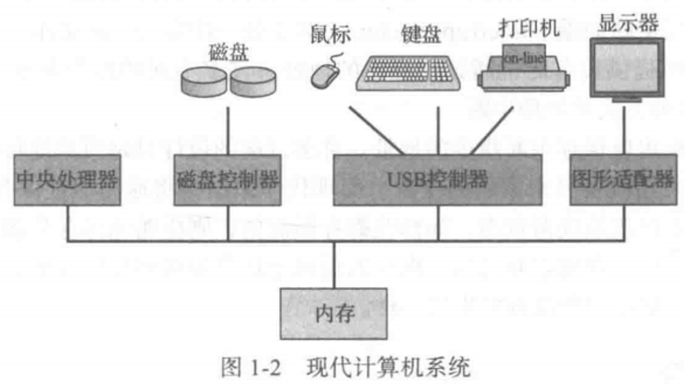
<br>

- 计算机系统的运行
  - 现代通用计算机系统包括一个或多个**cpu**和若干设备控制器，通过公用**总线**相连接，总线提供了共享内存的访问。
  - 每个设备控制器负责一类特定的**设备**（如磁盘驱动器、音频设备或视频显示器）。cpu与设备控制器可以并发执行，并竞争访问内存。为了确保有序访问共享内存，需要内存控制器来协调访问**内存**。
  - **引导程序**：当计算机开机运行时，需要运行一个初始程序，该程序位于计算机的固件（如**只读内存ROM**或电可擦编程只读内存EEPROM）。
    - 引导程序必须**知道如何加载操作系统**并开始执行系统。为了完成这一目标，引导程序必须定位操作系统内核并加载到内存。
    - 一旦**内核加载到内存并执行**，它就开始为系统与用户提供服务。除了内核外，系统程序也提供一些服务，它们在启动时加到内存而成为系统程序或系统后台程序。一旦这个阶段完成，系统就完全启动了，并且等待事件发生.
    - **事件发生**通常通过硬件或软件的**中断**来通知。硬件可以通过系统总线发送信号到cpu，以触发中断。软件可通过执行特别操作即**系统调用**，以**触发中断**。
    - 当**cpu被中断时**，它**停止正在做的事**，并立即转到固定位置再继续执行。该固定位置通常包含**中断服务程序**的开始地址。中断服务程序开始执行，在执行完后，cpu重新执行中断的计算。这一运行的时间表如图：
    - 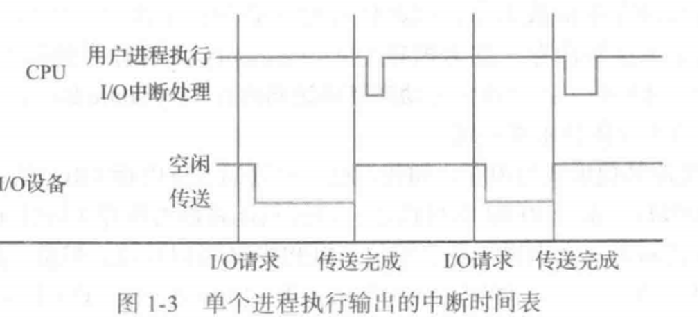
<br>

- 存储结构
  - 内存（main memory），也称**随机访问内存**（Random Access Memory，**RAM**），内存通常为动态随机访问内存（Dynamic Random Access Memory，**DRAM**）。
  - **只读内存**（Read Only Memory，**ROM**），数据不可修改，即不可写
  - 内存特点：**易失性**。掉电丢失数据。
  - 外存：磁盘、硬盘、U盘、光碟、固态硬盘等。**非易失性**，数据可**持久化**。
  - **存储设备层次图**
  - 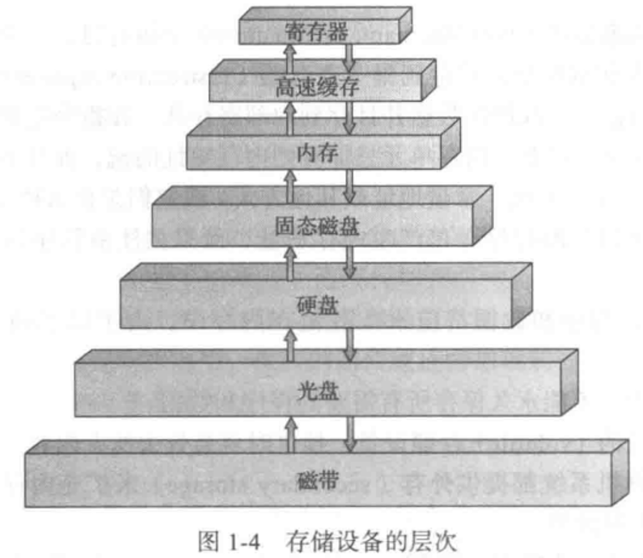
<br>

- I/O结构
  - 每个通用计算机系统由一个cpu和多个**设备控制器**组成，它们通过总线连接在一起。
  - 每个设备控制器管理某一特定类型的设备。
  - 通常，操作系统为每个设备控制器提供一个**设备驱动程序**（device driver）
<br>

## 计算机系统的体系结构
- 这里我们根据通用**处理器数量**来进行粗略分类。
- 单处理器系统
  - 只有一个cpu的系统。执行一个**通用指令集**（如x86指令集），该指令集包括执行用户进程的指令。
  - 几乎所有单处理器系统都带有其他的**专用处理器**。它们为特定设备的处理器，如磁盘、键盘、图形处理器。专用处理器执行**有限的**指令集，而并**不执行用户进程**。
- 多处理器系统
  - 多cpu系统，多核系统。集成多个计算核到**单个芯片**的系统，称为**多核**。
  - 优点：
    - 提高**系统吞吐量**
    - 规模经济
    - 增加可靠性
<br>

- 按**处理能力**分类
  - 非对称处理器：每个处理器都有各自特定的任务。一个主处理器控制系统，其它处理器或向主处理器要任务或处理预先规定的任务。这种称为**主从关系**。主处理器调度从处理器，并安排任务。
  - 对称处理器：每个处理器都参与完成操作系统的所有任务，处理器之间没有主从关系。如图：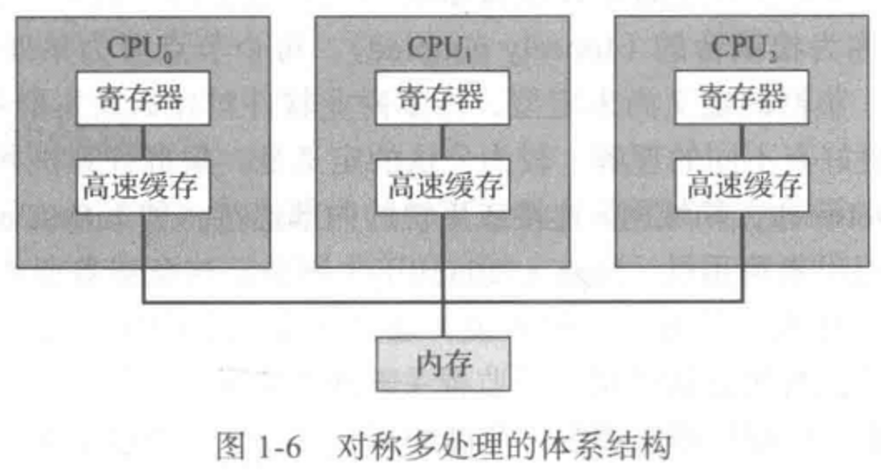
<br>

- 集群系统
  - 集群系统是由多个**独立的**计算机系统组成的系统，每个系统都有自己的**本地内存**和**本地磁盘**。
  - 这种系统将多个cpu组合在一起。一般通过网络连接，提供高可用性的服务。
  - 如图：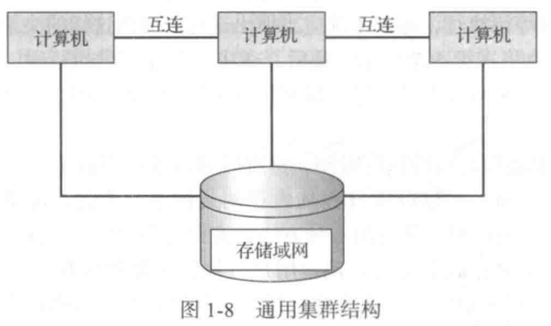

## 操作系统的结构
- 操作系统具有**多道程序能力**。一般来说，单个程序不能让cpu和IO设备始终忙碌。
- 单个用户通常具有多个运行程序。**多道程序设计**通过安排**作业**（job），使得cpu总有一个执行作业，从而**提高cpu利用率**。
- 操作系统在内存中同时保存多个任务。由于内存太小不能容纳所有作业，因此这些作业首先保存在**磁盘的作业池**（job pool）上。该作业池包括磁盘上的、等待分配内存的所有**进程**。
  - 如图：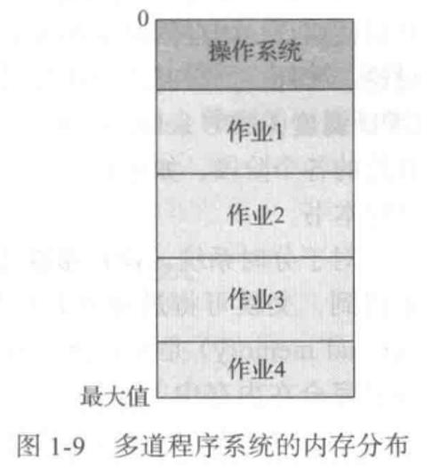
- **分时系统**是多道程序设计的自然延伸。对于分时系统，虽然cpu还是通过**切换作业**来执行多个作业，但是由于切换频率很高，用户可以在程序运行时与其交互。
- 分时系统需要确保**响应时间**。为每个用户提供**一小部分**的分时计算机资源。加载到内地并执行的程序，称为**进程**。

## 操作系统的执行
- 操作系统是**中断**驱动的。**事件**是由中断或陷阱（或异常）引起的。
- **陷阱（或异常）** 是一种 **软件生成的中断**，或源于出错，或源于用户程序的特定请求。
<br>

- 双重模式与多重模式的执行
  - 为确保操作系统的正确运行，必须区分**操作系统代码**和**用户代码**的执行。
  - 用户模式（user mode）和内核模式（kernel mode）
  - 计算机硬件可以通过**模式位**（mode bit）来表示当前模式：内核模式（0）和用户模式（1）。
  - 当计算机系统执行用户应用时，系统处于用户模式，当用户应用通过**系统调用**，请求操作系统服务时，系统必须**从用户模式切换到内核模式**
  - 如图：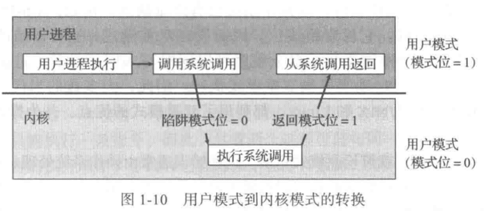
  - 双重模式执行**提供保护手段**，以便防止操作系统和用户程序受到错误用户程序的影响。
  - 这种防护实现为：将可能引起损害的机器指令作为**特权指令**，并且硬件只有**在内核模式下**才允许执行特权指令。
  - 如果在用户模式下试图执行特权指令，那么硬件并不执行该指令，而是认为该**指令非法**，并将以陷阱形式通知操作系统。
<br>

- 定时器
  - 操作系统应该维持控制cpu，防止用户程序陷入死循环，或不调用系统服务并且不将控制返给操作系统。为了实现这一目标可以使用定时器（timer）。
  - 定时器可设置为指定周期后中断计算机。

## 进程管理
- 在未被cpu执行之前，程序做不了任何事情。
- **执行中的程序称为进程**。
- 程序本身不是进程，程序是**被动实体**，而进程是**主动实体**。
- 单线程进程有一个**程序计数器（PC）**，指定了下一个所要执行的指令。
- 进程是系统的**工作单元**。系统由多个进程组成，其中有操作系统进程，也有用户进程。所有进程**并发执行**。
- 操作系统负责**进程管理**的以下活动：
  - 在cpu上**调度**进程和线程
  - 创建和销毁用户进程和系统进程
  - 挂起和重启进程
  - 提供进程同步机制
  - 提供进程通信机制

## 内存管理
- 内存简单理解就是一个大的**字节数组**。
- 如果cpu需要执行指令，那么这些数据必须首先通过cpu的IO调度传到内存。
- 为了改进cpu的利用率和用户的计算机响应速度。计算机应在**内存中保留多个程序**，这就需要内存管理。
- 操作系统负责**内存管理**的以下活动：
  - 记录内存的哪部分在被使用以及谁使用
  - 决定哪些进程会调入或调出内存
  - 根据需要分配和释放内存空间

## 存储管理
- 操作系统提供信息存储的**统一逻辑视图**。
- 操作系统对存储设备的物理属性进行了抽象，并定义了逻辑单元，即**文件**（File）。操作系统映射文件到物理媒介，并通过存储设备来访问文件。
- 如图：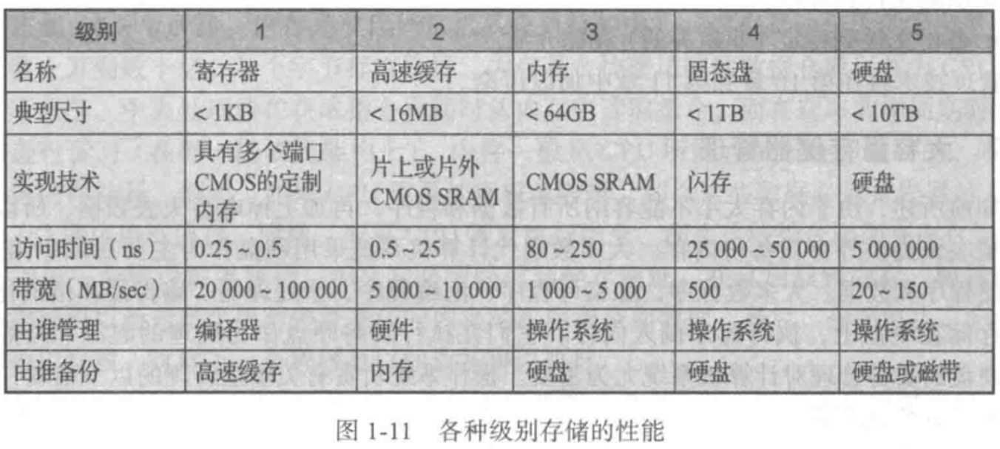
- 高速缓存（caching）一般集成在cpu中。
  - 高速缓存的几个问题
    - 为什么需要高速缓存
    - 高速缓存的大致原理是什么
    - 高速缓存的数据一致性问题
    - 多级高速缓存
- 如图：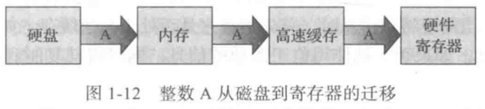
- I/O系统
  - **IO子系统**为操作系统本身隐藏了IO设备的特性。
  - IO子系统包括以下几个组件：
    - 包括缓冲、高速缓存和假脱机的内存管理组件
    - 设备驱动器的通用接口
    - 特定硬件设备的驱动程序
  - 只有**设备驱动程序**才能知道控制设备的特性。

## 保护与安全
- 保护是一种机制，用于控制进程或用户访问计算机系统的资源。比如阻止用户对内核接口的非法调用等。
- 安全：防止系统不受外部或内部的攻击。

## 内核数据结构
- 列表、堆栈、队列
- 树
- 哈希函数与哈希表
- 位图

## 计算环境
- 传统计算
- 移动计算
- 分布计算
  - 分布式系统是**物理上分开**的，通过**网络相连**的一组计算机系统。
  - 网络协议（如TCP/IP协议）、局域网、广域网、互联网
  - 网络操作系统
- 客户机-服务器计算
  - 如图：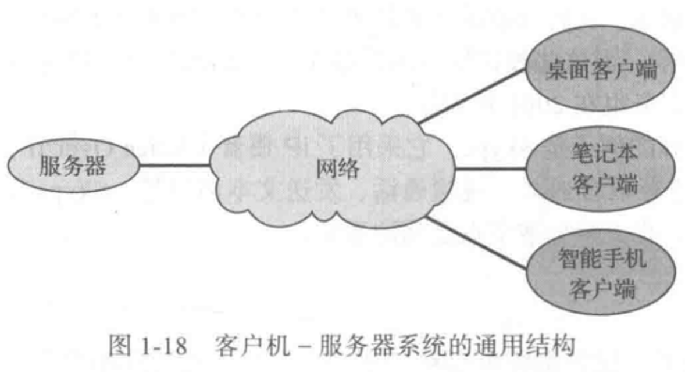
- 对等计算（P2P）
  - **对等系统**模型（Peer-to-Peer，P2P）这个模型**不区分客户机和服务器**。所有系统节点都是对等的。每个节点都可以作为客户机或服务器，这取决于它是提供请求还是提供服务。
  - 如图：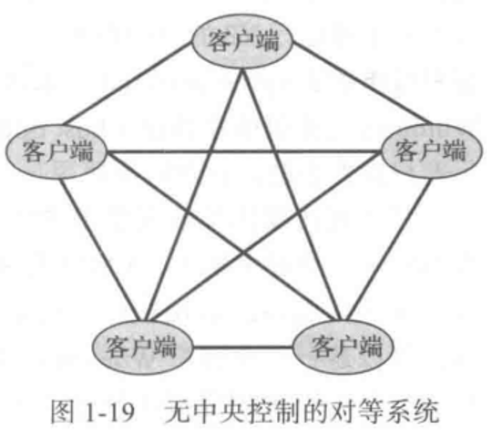
- 虚拟化
  - 通过虚拟化技术，操作系统可以在其他操作系统上运行应用程序。
  - 虚拟化技术是一种软件技术，用于实现模拟。如电脑上玩安卓游戏，需要安装安卓模拟器！
  - 如：VMware软件、JVM、阿里云服务器
  - 如图：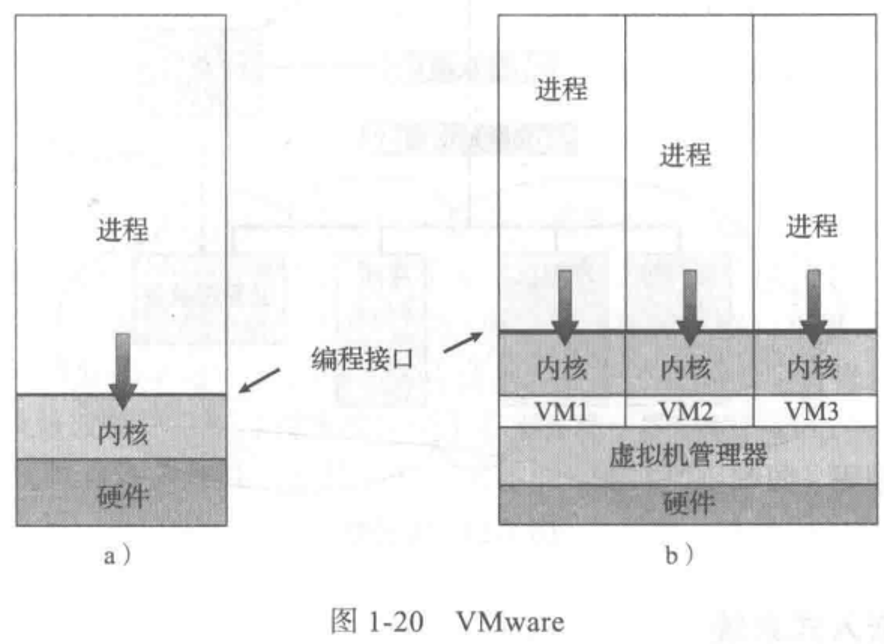
- 云计算
  - 云计算（cloud computing）可以通过网络提供计算、存储甚至应用程序登服务。从某些方面来看，它是**虚拟化技术的延伸**。
  - 云计算实际上有许多类型，包括：
    - 公有云（public cloud）
    - 私有云（private cloud）
    - 混合云（hybrid cloud）
    - 软件即服务（Software as a Service，SaaS）
    - 平台即服务（Platform as a Service，PaaS）
    - 基础设施及服务（Infrastructure as a Service，IaaS）
  - 如图：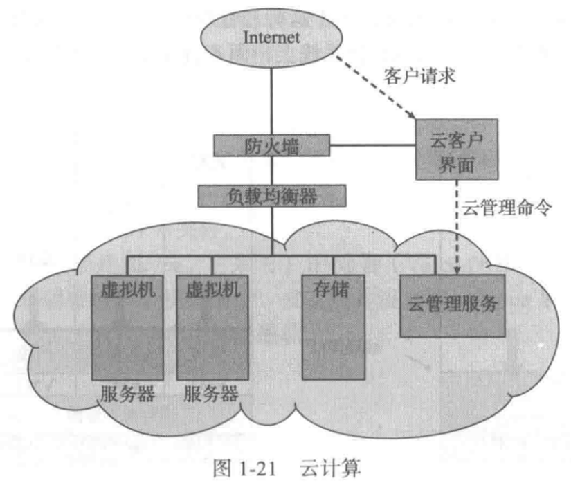
- 实时嵌入式系统
  - 如汽车、家电等都能应用到实时嵌入式系统。
  - 嵌入式系统几乎总是采用**实时操作系统**（real-time OS），比如导弹系统使用的是实时操作系统。
- 开源操作系统
  - Linux、Unix开源，开放源代码
  - Windows闭源，不开放源代码
  - Google的Android开放源代码
  - 苹果的IOS不开放源代码

# 第二章 操作系统结构
## 操作系统的服务
- 操作系统**提供环境**以便执行程序。它为程序及程序用户提供某些服务。
- 如图：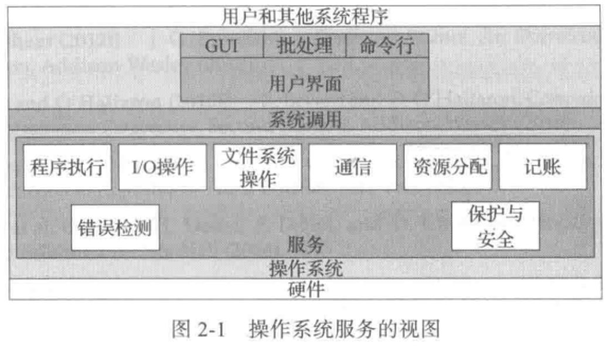
- 具体服务：
  - 用户界面：有多种形式，**命令行界面**、批处理界面、**图形用户界面**  （Graphical User Interface，**GUI**）。
  - **程序执行**：系统能加载程序到内存，并加以执行。
  - I/O操作：可以涉及文件或外设
  - **文件系统操作**
  - 通信：一个进程与另一个进程交换信息。包括内存共享、消息交换等。
  - 错误检测：需要不断的检测错误和更正错误。
  - **资源分配**：当多用户或多作用同时运行时，每个都应分配资源。
  - 记账：记录用户使用资源的类型和数量
  - 保护与安全
  - cpu

## 用户与操作系统的界面
- 分为**命令解释程序**（command interperter）和**图形用户界面**（GUI）。
  - **命令解释程序**（command interperter）是一种用户界面，它允许用户通过输入命令来与操作系统交互。
    - 如图，windows的dos命令行：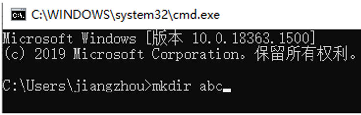
  - **图形用户界面**（GUI）是一种用户界面，它允许用户通过点击图标、菜单或按钮等元素来与操作系统交互。
    - 采用用户友好的图形用户界面（GUI）。
    - 优点：用户操作简单、方便
    - 缺点：消耗系统资源，系统复杂度更高，bug更多。

## 系统调用
- 系统调用提供了用户程序与操作系统之间的接口，用户程序可以通过系调用请求操作系统执行某些特权操作，如文件操作、进程管理、内存管等。
- 如图：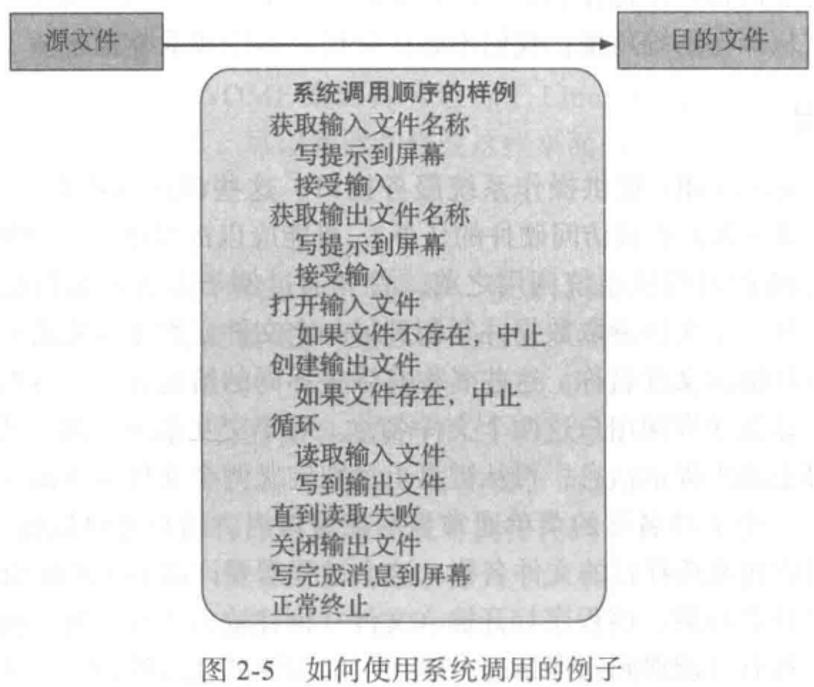
- 这些调用通常以c或c++编写，甚至是汇编语言编写。
- 通常应用开发人员根据**应用程序接口（API）**来设计程序。  
- 大部分程序设计语言（如c、c++、java等）都提供了**系统调用接口**，开发人员可以直接调用这些接口来实现系统调用。
    - 例如，在c语言中，开发人员可以使用`open()`函数来打开一个文件，使用`read()`函数来读取文件内容，使用`write()`函数来写入文件内容，使用`close()`函数来关闭文件。
<br>

- 系统调用的类型
- 大致分为六大类：
  - 进程控制
    - 结束、中止
    - 加载、执行
    - 创建进程、终止进程
    - 等待时间
    - 等待事件、信号事件
    - 分配和释放内存
  - 文件管理
    - 创建、删除、打开、关闭文件
    - 读取、写入文件
    - 重新定位文件指针
    - 获取文件属性、设置文件属性
  - 设备管理
    - 请求、释放设备
    - 读取、写入设备
    - 重新定位                        
    - 获取设备属性、设置设备属性
    - 逻辑附加或分离设备
  - 信息维护
    - 获取系统信息、设置系统信息
    - 获取时间或日期、设置时间或日期
    - 获取进程、文件或设备属性
    - 设置进程、文件或设备属性
  - 通信
    - 创建、删除通信连接
    - 发送、接收消息
    - 传送状态信息
    - 附加或分离远程设备
  - 保护
<br>

- 进程控制
  - 执行程序能正常或异常停止执行。如果一个系统调用异常停止停止当前执行的程序，那么可能转存储内存到磁盘，并生成错误信息
  - 通常，多个进程会**共享数据**。为了确保共享数据的完整性，操作系统通常提供系统调用。以允许一个进程**锁定**共享数据，防止其他进程同时访问或修改。
  - 如图：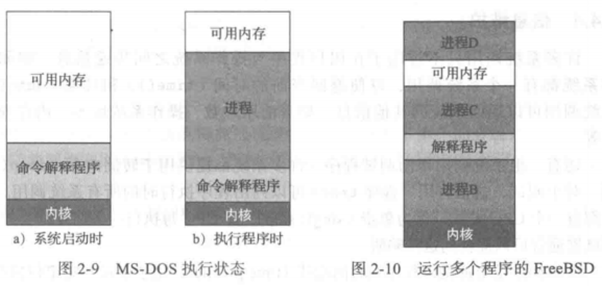

## 操作系统的结构
- 操作系统**庞大且复杂**，为了正常工作，操作系统通常被**分成子系统或模块**。
- 早期简单结构：
  - MS-DOS系统：没有采用复杂的结构，而是采用了简单的**分层结构**，没有很好的区分功能的接口和层次。
  - 最初的Unix系统：采用了**有限**的结构。
- **分层法**的主要优点是**简化了构造和调试**。所选的层次要求**每层只能调用更底层的功能和服务**。
- 微内核结构
  - 随着Unix不断壮大，其内核也变得更大更难以管理。
  - 采用**微内核技术**对内核进行**模块化**。即从内核中删除所有不必要的部件，将它们当作系统级与用户级的程序来实现。这样做的结构是**内核较小**；
  - 主要功能：为客户端程序和运行在用户空间的各种服务提供通信。通信是通过消息传递来实现的。
  - 优点：
    - 内核较小，易于维护和调试。
    - 便于扩展操作系统
    - 便于移植
    - 提高了安全性和可靠性。
  - 缺点：
    - 增加了系统调用的开销，因为每次系统调用都需要从用户空间切换到内核空间。
    - 微内核结构通常比分层结构更复杂，因此需要更多的开发人员来维护和调试。
    - 性能问题，由于微内核需要在用户空间和内核空间之间进行消息传递，因此会引入一定的延迟。
- 目前操作系统采用**可加载的**内核模块。
- 混合系统结构
  - 如Android分层模型。
## 操作系统如何启动？
- 加载内核以启动计算机的过程，称为**系统引导（booting）**。大多数计算机系统都有一小块代码，称为**引导程序**。引导程序能都定位内核，加载内核到内存中，并将控制权转交给内核。
- 引导程序通常存储在**只读内存（ROM）**中，因此它是**不可写的**。
---
# 第三章 进程
- 引入：早期计算机一次只能执行一个程序，该程序独占系统所有资源。现代操作系统支持多道程序设计，允许将多个程序同时加载到内存中并发执行，每个**运行的程序实例**称为一个**进程**。进程是分时系统的工作单位，通过cpu的多路复用实现**并发**。

## 进程概念
- 在讨论操作系统时，有个问题是关于如何称呼所有cpu活动。批处理系统把它叫做**执行作业（job）**，而分时系统把它叫做使用用户程序或**任务（task）**。即使单用户系统也可以同时运行多个任务（如文字处理、网页浏览等）。
- 即使用户一次只能执行一个程序，但是操作系统也需要支持本身的内部活动，如内存管理。所有的这些活动在许多方面都相似，因此统一被称为**进程（process）**。
<br>

- 程序本身不是进程，程序只是**被动实体**。如存储在磁盘上的可执行文件。而进程是**活动实体**。当一个可执行文件被加载到了内存时，这个程序就成为了一个进程。
- **进程是执行中的程序实例**。（同一个程序可以有多个进程）
- 进程是操作系统进行**资源分配和调度的基本单位**。
- 进程是执行的程序是一种**非正式**的说法。严格来说，进程还包括程序计数器、寄存器、栈、数据段、代码段等进程运行中的状态。

## 进程状态
- 进程在执行时，会经历不同的状态。这些状态包括：
  - **新状态**（new）：进程正在被创建，还没有开始执行。
  - **就绪状态**（ready）：进程已经准备好执行，等待cpu分配。
  - **执行状态**（running）：进程正在cpu上执行。
  - **等待状态**（waiting）：进程正在等待某个事件发生，如I/O操作完成，也称阻塞状态。
  - **终止状态**（terminated）：进程执行完毕，或者被操作系统强制终止。
  - 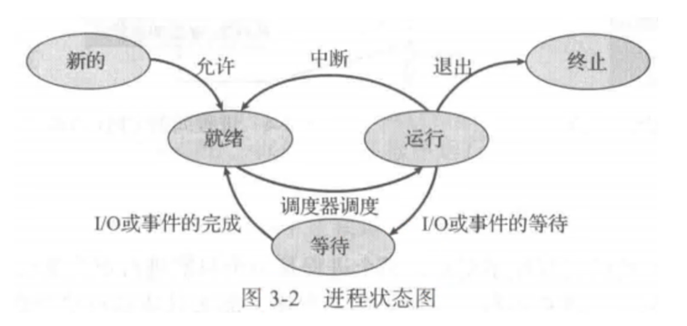 

## 进程控制块
- 操作系统中的每个进程采用**进程控制块**（Process Control Block，**PCB**）来表示。
- PCB包含了进程的所有信息
  - 进程状态：进程当前的执行状态（如新状态、就绪、执行、等待、终止状态等）。
  - 程序计数器：存储进程将要执行的下一个指令的地址。
  - cpu寄存器：发生中断时，这些状态信息与程序计数器一起被保存起来，以备进程在稍后的时间点恢复执行。
  - cpu调度信息：优先级、调度队列指针等，如进程的优先数、等待时间等。
  - 内存管理信息：包括基地址和界限寄存器的值、页表和段表等。
  - 记账信息：cpu使用时间、时间限制等。
  - I/O状态信息：包括分配给进程的I/O设备列表、打开文件列表等。
- 简而言之，PCB包含了进程的所有必要信息，操作系统需要使用这些信息来管理进程。
- 扩展一下：在Linux内核中，所有活动进程的表示都采用 task_struct 的**双向链表**。内核采用一个指针 current，用于指向当前正在执行的进程。通过轮询这个链表，操作系统可以切换到不同的进程。
- 到目前为止，讨论的模型中，每个进程是一个只能执行单个**线程**的程序。这种单一控制线程使得进程一次只能执行一个任务。

## 进程调度
- 多道程序设计的目的是，无论何时都有进程在执行，从而最大化利用cpu资源。分时系统的目的是进程之间快速切换，以提供用户交互的感觉。
- **进程调度器**会根据一定的策略，从就绪队列中选择一个进程，将其分配给cpu执行。单处理器系统不会同时执行多个进程，因此如果有多个进程，需要cpu空闲时才能调度。
<br>

- 调度队列
  - **作业队列**
  - **就绪队列**
  - **设备队列**
- 进程调度通常用队列图来表示。
<br>

- 调度程序：操作系统通过**调度程序**来**选择进程**，进而将其分配给cpu执行。
  - 长期调度程序、中期调度程序、短期调度程序
    - 大致上来说，长期调度是主要将大量程序按计划移入内存，中期调度根据实际情况将程序暂时移出内存时机到了再移入内存。短期调度是根据进程的优先数和其他因素来选择进程。
  - IO密集型进程、cpu密集型进程
    - IO密集型进程是指进程需要频繁进行I/O操作，如读写文件、网络通信等。而cpu密集型进程是指进程需要频繁进行计算，如数值计算、加密解密等。
<br>

- 上下文切换
  - **保存当前进程的状态**，并**加载下一个进程的状态**，这个过程称为**上下文切换**。
  - **中断**：当一个进程需要等待某个事件发生时，如I/O操作完成，操作系统会**中断**当前进程的执行，转而去执行其他进程。
  - 进程的上下文采用**PCB**表示。
  - 上下文切换的时间是纯粹的开销，因为在这个过程中，cpu没有做任何有用的工作，其耗时取决于硬件支持（如寄存器数量、内存速度等）。

## 进程运行
- 大多数系统的进程都是**并发执行**的，他们可以动态创建和删除。因此操作系统必须提供机制，以创建和终止进程。
<br>

- **进程创建**：
  - 进程在执行过程中，可能会创建一个或多个新的进程。创建进程的进程被称为**父进程**，而新创建的进程被称为**子进程**。每个新进程都可以再创建新的进程，形成**进程树**。
  - 大多数操作系统对进程的识别都是通过**唯一的进程标识符**（**pid**）来实现的，通常是一个整数值。通过pid可以访问内核中的进程的各种属性。
  - 当进程创建新进程时，会有两种执行可能：
    - 父进程与子进程并发执行。
    - 父进程等待子进程执行完毕后，才继续执行。
  - 新进程的地址空间也有两种可能：
    - 子进程时父进程的复制品（它具有与父进程相同的代码和数据）。
    - 子进程加载一个新的程序
  - 如Linux操作系统使用fork()系统调用创建新进程。
- **进程终止**：
  - 进程执行完毕，或者被操作系统强制终止，都会导致进程终止。
  - 当**进程终止**时，操作系统会**释放进程占用的资源**，如内存、文件描述符等。
  - 如Linux操作系统使用exit()系统调用终止进程。
  - **孤儿进程与僵尸进程**：
    - 若父进程先于子进程终止，子进程成为孤儿进程，通常由 init 进程（PID=1）收养。
    - 子进程已终止但父进程尚未调用 wait()，其PCB仍保留部分信息，此时称为僵尸进程，等待父进程收尸。
  - **级联终止**：当一个进程终止时，操作系统会终止所有子进程。

## 进程间通信
- 进程可以是**独立**的（不影响彼此）或**协作**的（可相互影响）。
- **进程协作**的好处：
  - **信息共享**：进程可以共享内存、文件、管道等资源，以实现信息的交换。
  - **计算加速**：进程可以并行执行，以加速计算任务。
  - **模块化**：进程可以被分解为多个模块，每个模块负责完成特定的任务。
- 协作进程需要一种**进程间通信机制**，以允许进程互相**交换数据与信息**。
- 进程间通信有两种基本模型：**内存共享**和**消息传递**。如图：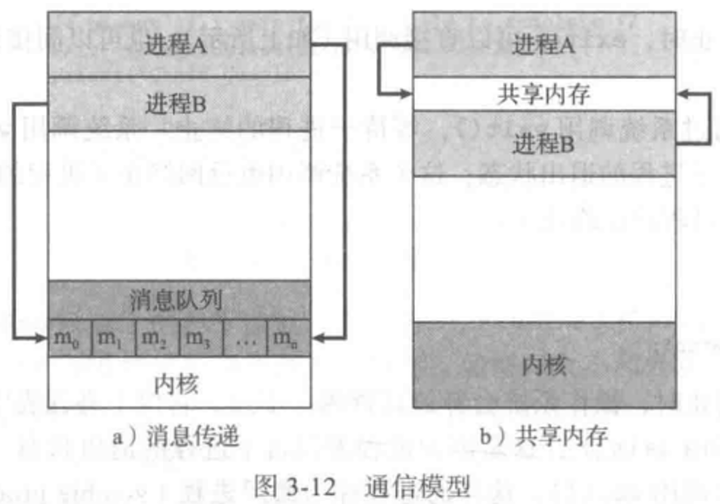
<br>

- **共享内存**系统：
  - 采用共享内存的进程间通信，需要通信进程建立**共享内存区域**。
  - 通常操作系统试图阻止一个进程访问另一个进程的内存。共享内存的进程需要**打破**这个规则。
  - 进程负责确保，它们不向同一个位置**同时写入**数据。
  - 生产者进程 ---> 缓冲区（存储共享数据） --->消费者进程
  - 缓冲区：分为**无界缓冲区**和**有界缓冲区**。
    - 无界缓冲区没有限制缓冲区大小，当缓冲区为空，消费者需要等待。
    - 有界缓冲区有固定大小。当缓冲区为空，消费者需要等待，如果缓冲区满，生产者必须等待。
<br>

- **消息传递**系统：
  - 采用消息传递的进程间通信，进程之间通过**发送消息**和**接收消息**来通信。
  - 如互联网聊天程序：send(message)   ---->  receive(message)
  - 直接通信：需要通信的每个进程必须明确指定通信的接收者和发送者。
  - 间接通信：通过邮箱或端口来发送和接收消息。
  - **阻塞**和**非阻塞**（即同步和异步）
    - 阻塞发送：发送进程阻塞，直到消息由接收进程所接收
    - 非阻塞发送：发送进程发送消息，并且恢复操作
    - 阻塞接收：接收进程阻塞，直到消息可用
    - 非阻塞接收：接收进程收到一个有效消息或空消息
  - 缓存
    - **零容量队列**：队列长度为0，发送者阻塞，直到接收者收到消息
    - **有限容量**：队列长度有限，队列空，消费者阻塞，队列满，生产者阻塞
    - **无限容量**：队列长度无限，发送者从不阻塞
<br>

- 客户机-服务器模型
  - 客户机-服务器模型是一种常用的进程间通信模型，它将进程分为客户机和服务器两种角色。
  - 通信的三种策略：socket（套接字）、远程过程调用PRC、管道。
    - **套接字**：套接字是一种通信端点，它允许进程在网络上进行通信。套接字通常由IP地址和端口号组成。这是一种**低级形式**的通信形式，它提供的是直接的、无结构的字节流传输。
    - **远程过程调用PRC**
    - **管道**：管道允许两个相关进程之间进行通信，它们之间通过**管道**来传递数据。在实现管道时，应该考虑四个方面：
      - 管道允许**单向**通信还是**双向**通信？
      - 如果是双向通信，管道是否是半双工还是全双工？（半双工：管道的写入端和读出端是独立的，不能同时进行读写操作。全双工：管道的写入端和读出端是同时进行读写操作。）
      - 通信进程之间是否有**同步**或**异步**关系？（父子关系）
      - 管道通信能否通过网络，还是只能在本地主机上进行通信？
    - **普通管道**：普通管道允许两个进程按标准的生产者-消费者方式进行通信。生产者向管道的一端写（写入端），消费者从管道的另一端读（读出端）。因此管道是单向的，**只允许单向通信**。如果需要双向通信，就要使用**两个管道**，而每个管道向不同方向发送数据。只有当进程相互通信时，普通管道才存在。一旦进程通信结束，普通管道就不存在了。
    - **命名管道**：命名管道的通信是双向的，并且父子关系不是必须的。当建立了一个命名管道后，多个进程都可用它通信。当通信进程完成后，命名管道**继续存在**，直到所有进程都关闭了它。
---

# 第四章 多线程编程
- 引入：之前的进程模型假设每个进程是具有**单个**控制线程的一个执行程序。几乎所有的现代操作系统都允许一个进程包含**多个**线程。
- 线程：线程是**cpu使用的基本单位**，包括线程ID、程序计数器、寄存器集合和栈。它与同一进程的其它线程共享代码段、数据段和其它操作系统资源。一个进程可以有多个线程，所以进程可以同时执行多个任务。
- 主线程：每个进程都有一个**主线程**，它是进程的**第一个线程**。主线程的**入口点**是main()函数。
```cpp
int main()
{
	printf(“hello world!”);
}
```
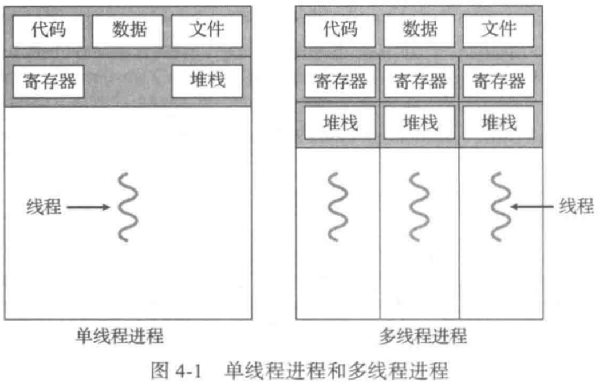
- 问题：一个进程为什么要创建多个线程？
  1. 操作系统创建多个进程比一个进程中创建多个线程的开销大
  2. 进程间通信和线程间通信更复杂。
  3. 例如，一个Web服务器需要处理多个客户端请求，每个请求可以由一个线程来处理。
- 线程的优势
  - 响应性：如果一个交互程序采用多线程，那么即使部分阻塞或执行冗余操作，它仍然可以继续执行，从而增加对用户的响应程度。
  - **资源共享**：进程只能通过如共享内存和消息传递之类的技术实现共享资源。而线程默认共享它们所属进程的内存和资源
  - 经济：线程的创建和销毁比进程要快得多。
  - 可伸缩性：对于多核处理器，**线程可以在多个核心上并行执行**。

## 多核编程
- ps：早期计算机是单核 ---> 现代计算机是多核
- 多核编程提供机制，以便更有效的使用这些多个计算核和改进**并发性**。如图：
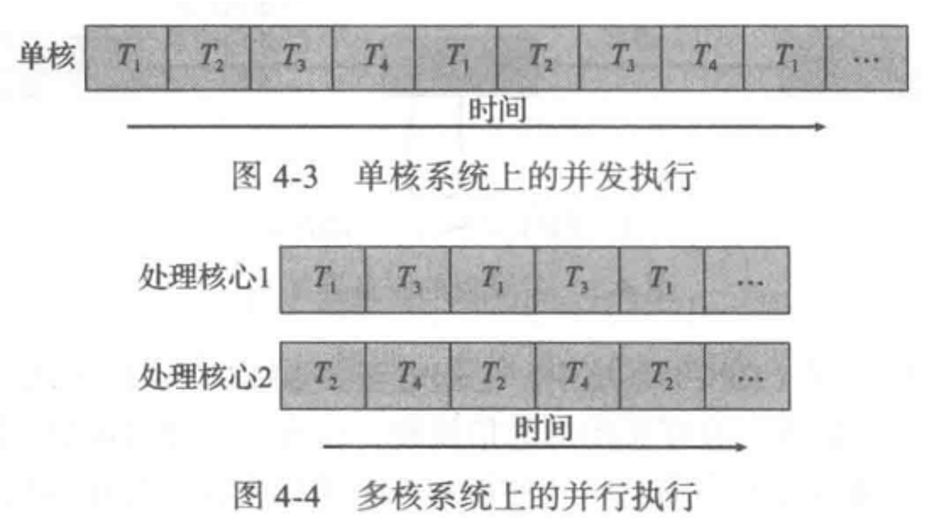
- <u>**重点理解------<并行>与<并发>**</u>
  - **并行**性：并行系统可以同时执行多个任务，指多核系统，多个进程同时执行的情况。
  - **并发**性：并发系统也可以同时执行多个任务。指通过cpu上下文切换，执行多个任务的情况。
  - cpu调度器通过**快速切换**系统内的进程，以便允许每个进程取得进展，从而提供并行假象。

## 多线程编程
- 提供线程支持的两种方式
  - **内核线程**：内核层，由操作系统内核直接支持和管理。
  - **用户线程**：用户层，位于内核之上，由用户程序直接支持和管理。
<br>

- 线程模型分类
  - 多对一模型
    - 映射多个用户级线程到一个内核线程。线程管理是由用户空间的线程库来完成，因此效率更高。
    - 如果一个线程执行阻塞系统调用，那么整个进程将会阻塞。
    - 因为任一时间只有一个线程可以访问内核，所以多个线程不能并行运行在多处理核系统上。
    - 现代操作系统基本**不使用该模型**，因为它**无法利用多个处理核**。
    - 如图：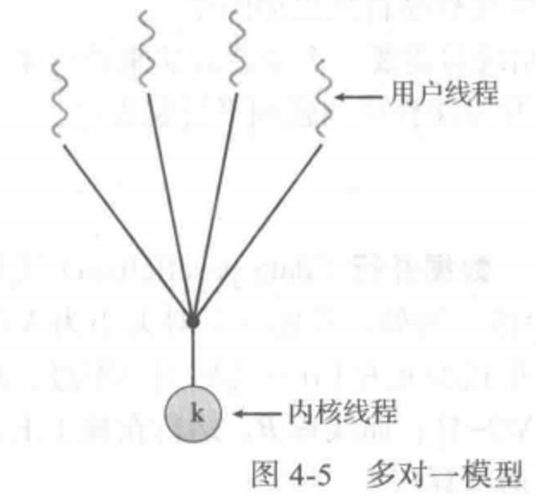
  - 一对一模型
    - 映射每个用户线程到一个内核线程。
    - 该模型在一个线程执行阻塞系统调用时，能够允许另一个线程继续执行，所以它提供了比多对一模型更好的并发功能。
    - 也允许多个线程并行运行在多处理器系统上。
    - 该模型的唯一**缺点**是：创建一个用户线程就要创建一个相应的内核线程，由于创建内核线程的开销会影响应用程序的性能。
    - 如图：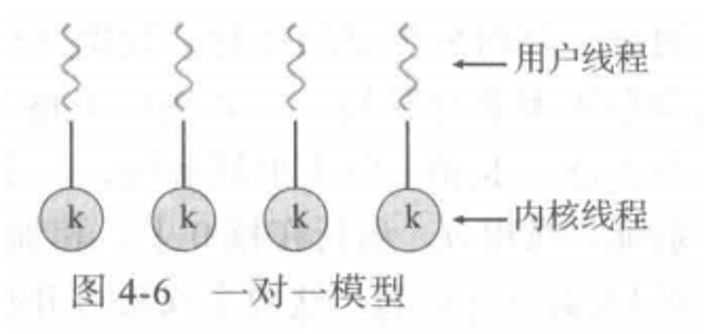
  - 多对多模型
    - **多路复用**多个用户线程到同样数量或更少数量的的内核线程。
    - 可以创建任意多的用户线程，并且相应内核线程在多处理器系统上并发执行，当一个线程执行阻塞系统调用时，内核可以调用另一个线程来执行。
    - 如图：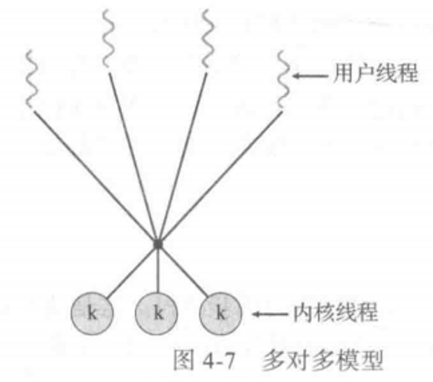
    - **双层模型**：是多对多模型的变种，任然多路复用多个用户线程到同样数量或更少数量的内核线程，但也允许绑定某个用户线程到一个内核线程。
    - 如图：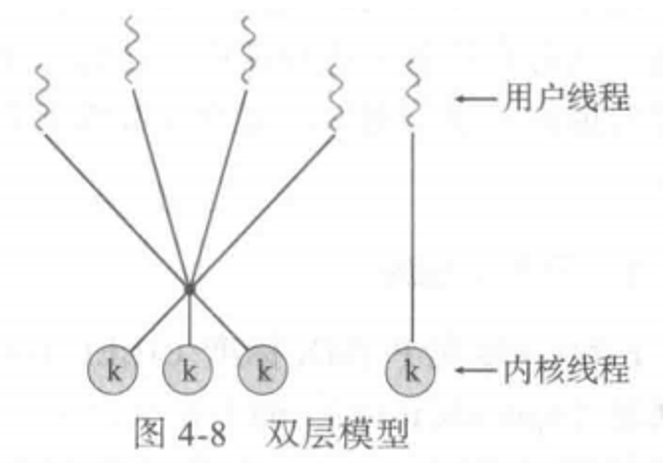
<br>

- 线程库
  - 线程库是一个**软件库**，它提供了创建、管理和同步线程的（API）函数。
<br>

- 线程池
  - 主要思想：在进程开始时创建一定数量的线程，并加到池中等待工作。当有新的任务到达时，线程池中的线程会被唤醒执行任务。任务完成后，线程会继续等待下一个任务。
  - 线程池的优势在于：
    - 可以**重用线程**，避免了线程创建和销毁的开销。
    - 可以**限制线程的数量**，避免了系统资源的浪费。
    - 将执行任务从创建任务的机制中分离出来，从而**提高了系统的响应性**。

# 第五章 进程调度
- 引入：
  - **cpu调度**是多道程序操作系统的基础，通过在**进程间切换cpu**，操作系统可以使得多个进程并发执行，从而使计算机更加高效。

## 基本概念
- 对于**单处理器**系统，同一时间只有一个进程可以运行，其他的进程都等待，直到cpu空闲并可调度为止。
- 多道程序的目的是，始终允许某个进程运行以最大化cpu利用率。
- 当一个进程等待时，操作系统就从该进程接管cpu控制，并将cpu交给另一进程执行。即操作系统**选择进程**，并交给cpu执行。
- 进程执行包括周期进行**cpu执行**和**IO等待**。进程在这两个状态之不断交替。
  - IO密集型进程 & cpu密集型进程
  - 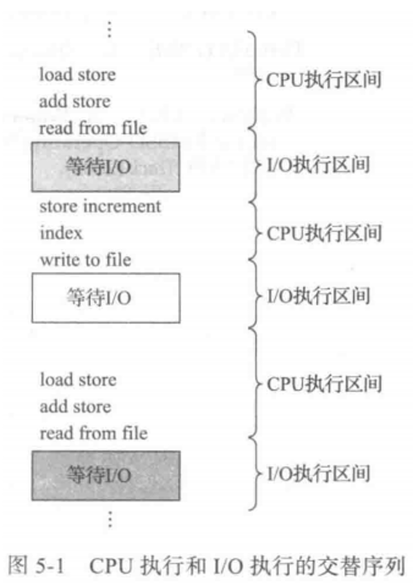
<br>

- cpu调度程序
  - 每当cpu空闲时，操作系统必须从**就绪队列**中选择一个进程来执行。这个选择过程由**cpu调度程序**负责。
  - cpu调度程序也称为**短期调度程序**，它的任务是从内存中处于就绪状态的进程里挑选一个合适的进程，并将cpu分配给它。
  - 就绪队列：就绪队列包含所有准备就绪、等待cpu运行的进程。队列中的每个元素通常是一个**进程控制块（PCB）**，它记录了进程的相关信息。
<br>

- 抢占调度
  - cpu调度发生的时机
  - 当以下四种情况之一发生时，操作系统需要重新进行cpu调度：
    1. 进程从运行状态切换到等待状态（例如发起I/O请求）
    2. 进程从运行状态切换到就绪状态（例如时钟中断）
    3. 进程从等待状态切换到就绪状态（例如I/O完成）
    4. 进程终止
  - 调度方式：非抢占与抢占
    - 根据调度发生的时机，可将cpu调度方案分为两类：
    - **非抢占调度**
      - 调度仅发生在第1种和第4种情况下（即进程主动放弃cpu或终止时）。
      - 特点：一旦进程获得cpu，它将一直运行直到终止或主动进入等待状态。
    - **抢占调度**  
      - 调度可以发生在所有四种情况下，包括第2种和第3种情况。  
      - 特点：操作系统可以在进程未主动放弃cpu时强制剥夺其使用权，实现更灵活的资源分配。
<br>

- 调度程序（Dispatcher）
  - 定义：调度程序是一个模块，负责将cpu的控制权交给由**短期调度程序**选中的进程。
  - **主要功能**  
    - 调度程序在执行过程中需要完成以下三个关键步骤：
      1. **切换上下文**：保存当前进程的上下文（如寄存器、程序计数器等），并加载新进程的上下文。
      2. **切换到用户模式**：将cpu从内核模式切换至用户模式，以便新进程在用户态下运行。
      3. **跳转到用户程序的合适位置**：设置程序计数器，使cpu能够从新进程上次中断的位置继续执行，或从其入口点开始运行。
  - **性能要求**  
    - 调度程序在每次进程切换时都会被调用，因此必须**尽可能快**，以减少系统开销。
  - **调度延迟**  
    - 调度程序停止一个进程并启动另一个进程所需的时间称为**调度延迟**。该时间直接影响系统的响应速度和整体性能。

## 调度算法的比较准则
- 为了评估和比较不同的cpu调度算法，通常采用以下关键性能指标。选择些指标作为衡量标准，会直接影响对“最佳”算法的判断。
  - **cpu使用率**  
    - 指cpu处于忙碌状态的时间百分比。理想情况下，应使cpu尽可能忙碌，避免空闲。  
    - 实际范围：从轻负荷系统的40%到重负荷系统的90%。
  - **吞吐量**  
    - 单位时间内（如每秒）完成的进程数量。该指标反映了系统的处理能力。、
  - **周转时间**  
    - 从进程提交到进程完成所经过的总时间。它包括进程进入内存、在就绪队列中等待、在cpu上执行以及进行I/O操作等所有阶段的时间之和。
  - **等待时间**  
    - 进程在就绪队列中等待cpu的总时间。注意，它不包括I/O等待或其他阻塞时间。
  - **响应时间**  
    - 从提交请求到系统产生第一响应所经历的时间。对于交互式系统，响应时间比周转时间更为关键。
- 这些指标往往相互影响，需要在设计调度算法时根据系统目标进行权衡。例如，提高吞吐量可能会增加响应时间，而降低等待时间则可能提高公平性。
- 总的来说：要尽量**最大化cpu使用率和吞吐量**，同时**最小化周转时间、等待时间、和响应时间**。
<br>

## 调度算法
- 引入：CPU调度处理的问题是，从就绪队列中选择进程以便为其分配CPU。那么按照怎样的策略或方式来选择进程，就是调度算法要处理的事情。
- 分类：
  - 先到先服务（FCFS）
    - 最简单的CPU调度算法时**先到先服务**（First-Come First-Served，**FCFS**）调度算法。采用这种方案，先请求CPU的进程首先分配到CPU。可以通过**FIFO队列**容易地实现。
    - 当一个进程进入就行队列时，它的PCB会被链接到队列尾部。当CPU空闲时，它会分配给位于队列头部的进程，并且这个运行进程从队列中移除。
    - 优点：算法实现非常简单。
    - 缺点：平均等待时间往往很长。
    - 如图：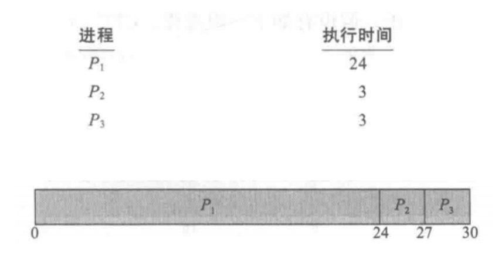
    - ps：FCFS调度算法是**非抢占的**。一旦CPU分配给了一个进程，该进程就会一直使用CPU直到释放CPU。
  - 最短作业优先（SJF）
    - **最短作业优先**（Shortest-Job-First，**SJF**）调度算法将每个进程与其下次CPU执行的长度关联起来。当CPU空闲时，它会被赋给具有最短CPU执行的进程。
    - SJF算法也叫也叫**最短下次CPU执行算法**，因为调度取决于进程的下次CPU执行的长度，而不是其总的长度。
    - 如图：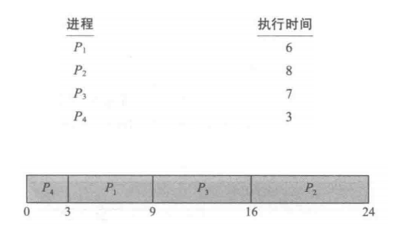   
    - 优点：SJF算法是**最优的**，因为平均等待时间最小（即CPU更忙碌）。短进程等待时间减少，长进程等待时间增加，从而平均等待时间减少。
    - **问题：如何知道下次CPU执行的长度？**
      - 对于批处理系统的长期调度，可以将用户提交作业时指定的进程时限作为长度。SJF调度经常用于长期调度。
      - SJF算法不能在短期CPU调度级别上加以实现，因为没有办法知道下次CPU执行的长度。一种方法是试图近似SJF调度，即**预测下次CPU执行长度**，可以认为下次CPU执行长度与以前的相似。
    - SJF算法可以是**抢占式或非抢占式**的。当一个新进程到达就绪队列而以前进程正在执行时，就需要选择了。新进程的下次CPU执行，与当前运行进程的尚未完成的CPU执行相比，可能还要小。
    - 抢占SJF算法会抢占当前运行进程，而非抢占SJF算法会允许当前运行进程先完成CPU执行。抢占SJF调度有时称为**最短剩余时间优先调度**。
    - 如图：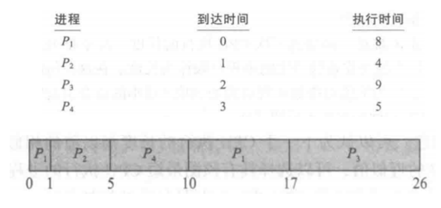
  - 优先级调度（PS）
    - 每个进程都有一个**优先级**与其关联，而具有最高优先级的进程会分配到CPU。具有相同优先级的进程按FCFS顺序调度。
    - SJF算法是优先级调度算法的一个特例。其优先级为下次CPU执行的倒数。CPU执行越长，则优先级越小。
    - 如图：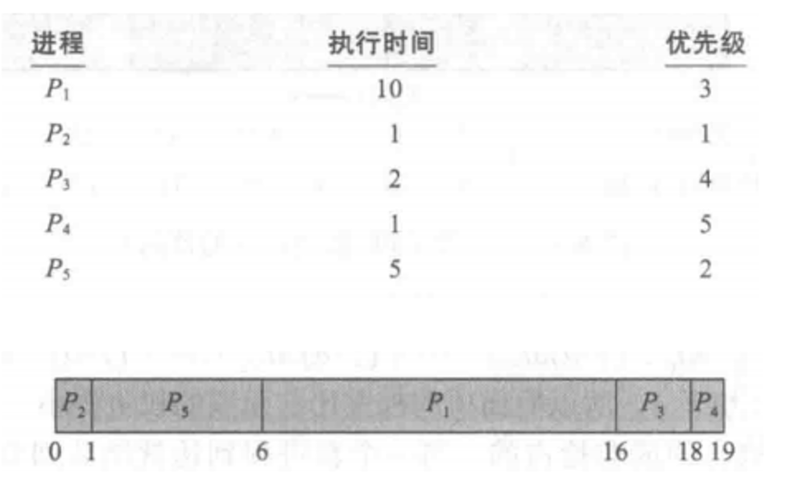
    - 优先级调度可以是**抢占的或非抢占的**。
    - 优先级调度算法的一个主要问题是**无穷阻塞**或**饥饿**问题。
    - 低优先级进程的饥饿问题的解决方案之一是**老化**。老化逐渐增加在系统中等待很长时间的进程的优先级。
  - 轮转调度（RR）
    - **轮转调度**（Round Robin，**RR**）调度算法为每个进程分配一个固定的时间片，称为**时间片**。每个进程在时间片内执行，然后被抢占，将CPU分配给就绪队列中的下一个进程。
    - 如图：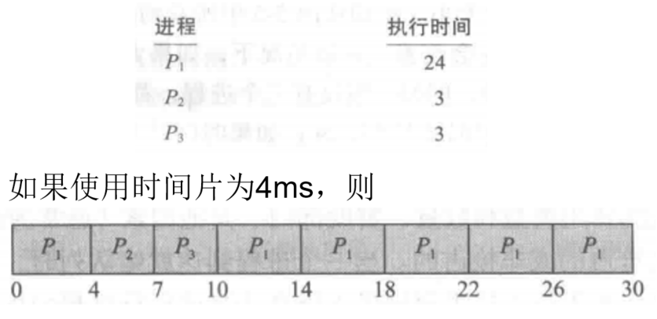
    - 时间片的长度是一个重要的参数。RR算法的性能很大程度取决于时间片的大小。如果时间片很大，那么RR算法与FCFS算法一样，如果时间片很小，会导致频繁的上下文切换，从而增加了系统的开销。
    - 如图：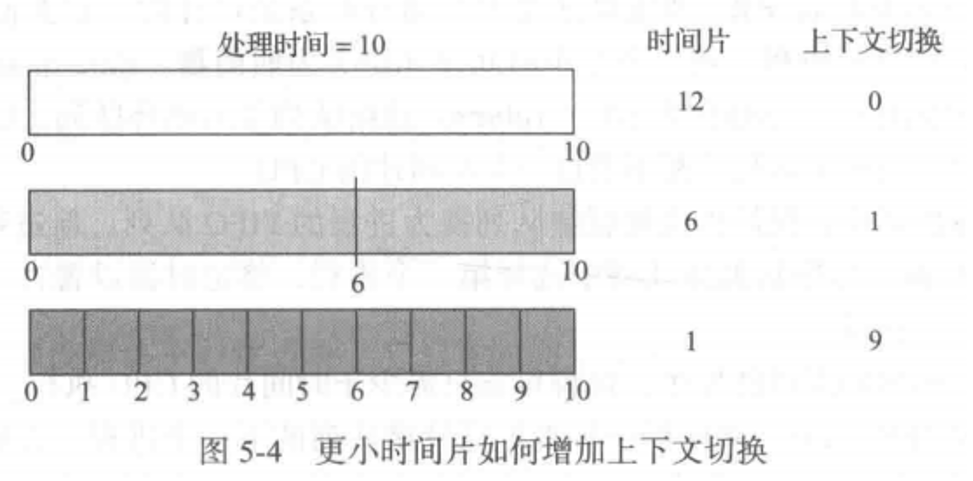!
    - 优点：  
      - 简单实现。
      - 每个进程都有机会执行，避免了饥饿问题。
      - 响应时间较短。
    - 缺点：
      - 平均等待时间较长。
      - 时间片长度选择不当会导致性能问题。
  - 多级队列调度  
    - 多级队列调度算法将就绪队列**分成多个单独队列**。每个队列有自己的优先级。
    - 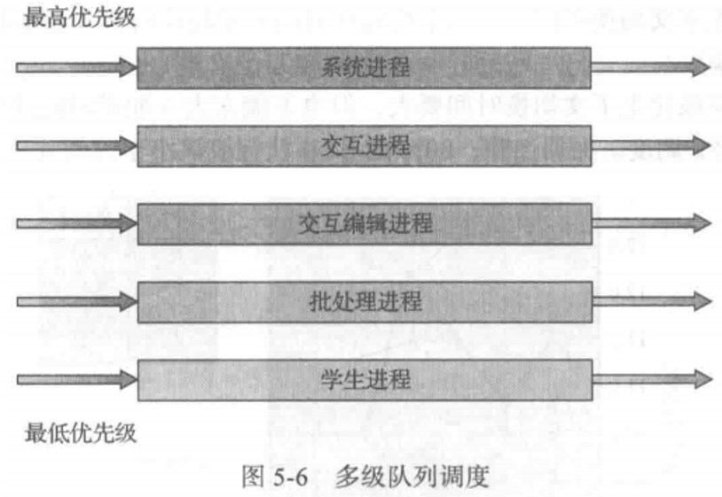
    - 根据进程属性，如内存大小，进程优先级、进程类型等，一个进程**永久**分到一个队列。每个队列有自己的调度算法。
    - 每个队列与更低层队列相比有绝对的优先。
    - 优点：优先级高的进程优先执行
    - 缺点：可能存在饥饿问题
  - 多级反馈队列调度
    - 使用多级队列算法时，进程进入系统时被**永久分配**到某个队列。而多级反馈队列调度算法允许进程在队列之间**迁移**。
    - 这种算法根据不同的CPU执行的特点来区分进程。如果进程使用过多的CPU时间，那么它会被移到更低的优先级队列。
    - 这种方案将IO密集型和交互进程放在更高优先级队列上。在较低优先级队列中等待过长的进程会被移到更高优先级队列，以**阻止饥饿的发生**。
    - 如图：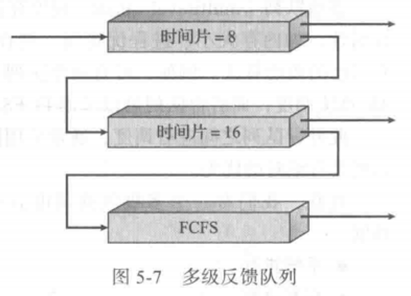

## 多处理器调度
- 之前讨论的主要是单处理器系统的CPU调度问题。如果多个CPU，则**负载分配**成为可能，但是调度问题更为复杂。
- 方法：
  - **非对称多处理**
    - 对于多处理器系统，CPU调度的一种方法是让一个处理器（主服务器）处理所有调度决定、IO处理以及其他**系统活动**，其他的处理器**只执行用户代码**。
    - 这种调度方式很简单，因为只有一个处理器访问系统数据结构，减少了数据共享的需要。
  - **对称多处理**
    - 多对称处理（Symmetric MultiProcessing，**SMP**），即每个处理器自我调度。所有进程可能处于一个共同的就绪队列中，或处理器都有它自己的私有就绪进程队列。
    - 调度这样进行：每个处理器的调度程序都检查共同就绪队列，以便选择执行一个进程。
<br>

- 处理器亲和性
  - 当一个进程运行在一个特定处理器上时**缓存**时。进程最近访问的数据会更新处理器的缓存。而进程的后续内存访问通常是通过缓存来满足的。
  - 如果进程移到其他处理器上则会发生什么。第一个处理器缓存的内容变为**无效**，第二个处理器缓存**重新填充**。大多数系统试图避免将进程从一个处理器移到另一个处理器，而是试图让一个进程运行在同一个处理器上。这称为**处理器亲和性**，即一个进程对它运行的处理器具有亲和性。
  - 处理器的亲和性具有多种形式。当一个操作系统试图保持进程运行在同一处理器上时（但**不保证**它会这么做，这个进程也可迁移到其他处理器上），这种情况称为**软亲和性**。
  - 有的SMP系统提供系统调用以便支持**硬亲和性**，从而允许某个进程只运行在某个处理器子集上。
  - 许多系统提供软亲和性和硬亲和性。
<br>

- **负载平衡**
  - 负载平衡是指平均分配系统资源，以防止任何一个资源**过载**或者**空闲**。
  - 对于SMP系统，重要的是保持所有处理器的负载平衡，以便充分利用多处理器的优点。否则一个或多个处理器会空闲，而其他处理器会处于高负载状态，且有一系列进程处于等待状态。
  - 负载平衡设法将负载平均分配到SMP系统的所有处理器。

## 实时CPU调度
- 实时CPU调度是指为实时系统中的进程分配CPU时间的过程。实时系统是指那些对响应时间有严格要求的系统，例如航空航天系统、医疗设备、机器人等。
- 实时cpu调度与普通调度的区别
  - 普通调度追求周转时间短、公平、吞吐量高；
  - 实时调度只追求一件事：任务必须在规定的截止时间（deadline）内完成，否则系统失效。
- 实时任务一般都有明确的时间约束，分为两类：**软实时任务**和**硬实时任务**。
  - **软实时任务**：在软实时任务中，进程的截止时间是一个软限制，即进程在截止时间之前完成是可选的。如果进程在截止时间之前完成，系统将为其分配额外的时间。即软实时系统不保证调度关键实时进程。而只保证这类进程会优先于非关键进程。翻译一下：<u>希望尽量按时完成，偶尔轻微超时可以接受。</u>
  - **硬实时任务**：在硬实时任务中，进程的截止时间是一个硬限制，即进程必须在截止时间之前完成。如果进程在截止时间之后完成，系统将认为该进程是失败的，等效于没有完成。<u>必须绝对在 deadline 之前完成，超时就是严重事故。</u>
<br>

- 最小化延迟
  - 事件延迟概念：从事件发生到事件得到服务的这段时间称为**事件延迟**。
    - 如图：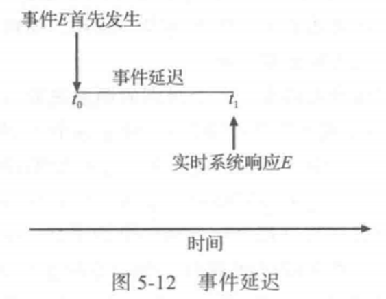
    - 实时系统对「事件延迟」很敏感，因为如汽车刹车、工业控制、航天发动机控制，事件延迟一旦超过允许上限，导致错过 deadline，可能直接导致事故。而普通pc只是会略有延迟和卡顿。
  - 常见的2种事件延迟：**中断延时**和**调度延时**。
    - 中断延时
      - 中断触发 ---> 到中断服务例程（ISR）开始执行的时间。
      - 当一个中断发生时，操作系统应先完成正在执行的指令，再确定发生中断的类型。然后，应保存当前进程的状态，再采用特定的中断服务程序（Interrupt Service Routine ，ISR）来处理中断。执行这些任务需要的总时间称为**中断延迟**。
      - 如图：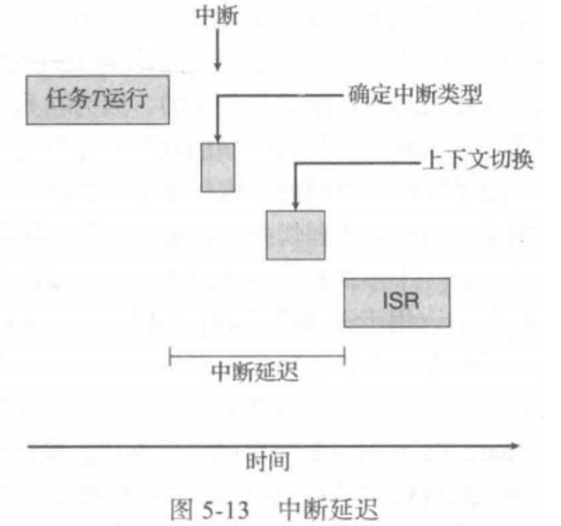
      - 中断延迟的产生往往来自**硬件**。
    - 调度延时
      - 调度程序决定切换进程 / 线程 ---> 到新进程真正开始运行的时间。
      - 调度程序从停止一个进程到启动另一个进程所需的时间量称为**调度延迟**。实时操作系统应**最大限度的减少这种延迟**。保持调度延迟尽可能低的最有效技术是：提供**抢占式内核**。
      - 下图说明了调度延迟的组成部分。调度延迟的**冲突部分**有两部分：1.抢占在内核中运行的任何进程；2.释放高优先级进程所需的、低优先级进程占有的资源。
      - 如图：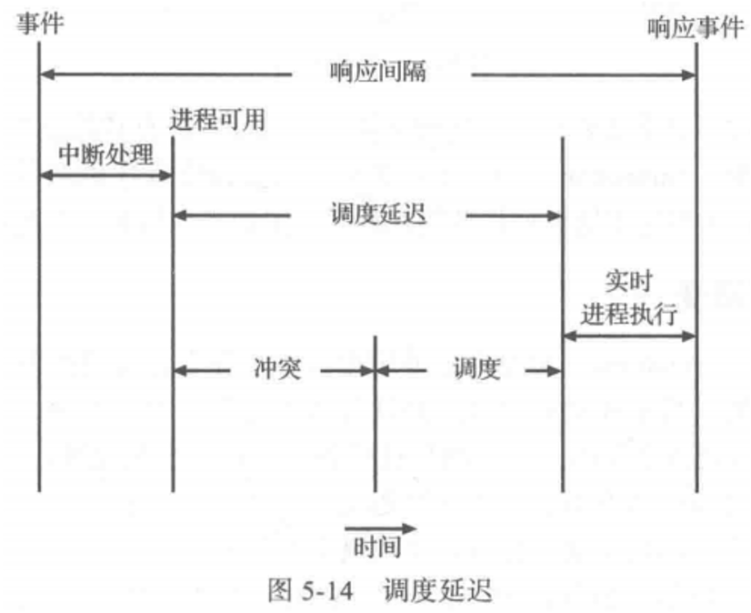!
      - 为什么会有调度延迟？
        - 中断只是 “通知系统该切换了”，但系统要完成：保存旧进程 ---> 调度选择 ---> 加载新进程，这一整套操作花的时间，就是调度延迟。所以不可能 “中断一完立刻执行”。
      - 调度延迟的产生往往来自**操作系统内核**。
<br>

  - 优先权调度
    - 实时操作系统最重要的功能是：当一个实时进程需要CPU时，立即响应。因此，用于实时操作系统的调度程序应支持**抢占的、基于优先权的**算法。
    - 基于优先级的调度算法根据每个进程的重要性而分配优先级。进程越重要，它分配的优先级也越高。
    - 如果调度程序还支持抢占，并且有一个更高优先级的进程处于就绪，那么正在运行的、低优先级的进程被抢占。
    - 提供抢占的、基于优先级的调度程序**仅保证软实时**功能。
    - 硬实时系统应进一步保证实时任务应在**截止期限内**得到服务，做出这样的保证需要**附加的调度特征**。
    - **调度进程**的一些补充知识
      - **周期性**：进程是周期性的，也就是说，它们定期需要cpu。一旦周期性进程获得cpu，它具有固定的处理时间t、cpu应处理的截止期限d和周期p。
      - 周期任务的速率为1/p。
      - 处理时间t、截止期限d和周期p之间的关系为：0 ≤ t ≤ d ≤ p
      - 下图描述了一个周期性进程随时间的执行情况，调度程序可以利用这些特性，根据进程的**截止期限**或**速率**要求来分配优先级。
      - 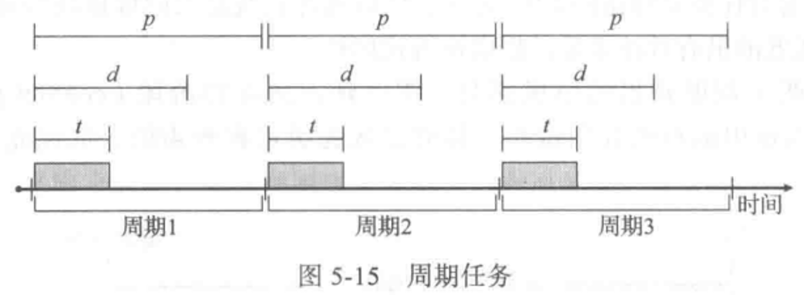
      - 调度程序只会做2件事：承认进程，**保证进程完成**；如果它不能保证任务能在截止期限之前得到服务，**拒绝请求**。
<br>

- **单调速率调度**
  - <u> 核心规则：**任务的周期越短 ---> 速率越快 ---> 优先级越高** </u>
  - 并且：<u> **优先级一旦分配，运行时永远不变**（静态优先级）。</u>
  - 单调速率(rate-monotonic) 调度算法采用**抢占的**、**静态优先级**的策略， 调度周期性任务。
  - 当较低优先级的进程正在运行并且较高优先级的进程可以运行时，较高优先级进程将会抢占低优先级。
  - 调度策略：更频繁地需要 CPU 的任务应分配更高的优先级，此外，单调速率调度假定：对于每次CPU执行，周期性进程的处理时间是相同的。
    - 逐句拆解分析：
      - 「更频繁需要 CPU」 = 周期短、速率快
        举例：
        - 任务 A：每 10ms 要运行一次
        - 任务 B：每 100ms 要运行一次
        A 明显更频繁。
      - 为什么要给 A 更高优先级？
        理由：
        - 频繁的任务，**deadline** 来得快、来得密；
        - 如果不给它高优先级，让它被别的任务打断太久，它很容易就超时；
        - 而周期长的任务，时间宽裕得多，晚一点跑也不容易出事。
      - 核心逻辑：RMS 的设计思想是「谁更着急、谁来得更勤，谁就优先」，这也是“速率单调”的由来。
      - 假定条件解读：同一个周期性进程，每次占用CPU执行的处理时间固定不变（无波动），这是RMS能提前计算利用率、保证实时性的前提。
  - <u> **利用率上限** </u>
    - **核心公式**（n为任务个数）
      - RMS的最坏情况（最容易超时）利用率上限为：
      - $$U_{max} = n \times \left( 2^{\frac{1}{n}} - 1 \right)$$
      - 说明：该公式是“充分条件”——只要总利用率≤U_max，RMS一定能调度成功（无超时）；若总利用率>U_max，不保证调度成功（大概率超时）。
    - 常用n值对应的**上限**（直接背就行）
      - | 任务个数（n） | RMS利用率上限（≈） | 关键说明 |
        | --- | --- | --- |
        | 1 | 100% | 单个任务可完全占用CPU，无抢占，必不超时 |
        | 2 | 82.84%（常记83%） | 最常用场景，重点记忆 |
        | 3 | 78% | 任务数增加，上限降低 |
        | 4 | 75.7% | |
        | n→∞（很多任务） | 69.3% | 课本常说的“RMS上限≈69.3%”，指多任务场景 |
    - 利用率上限的**推导逻辑**（理解不用背）
      - 核心思路：推导“最坏情况”（t=0时刻所有任务同时到达，高优先级疯狂抢占低优先级）下，低优先级任务刚好能在截止期前跑完的极限利用率。
      - 以n=2为例：设P2=2P1（抢占最密集的极限比例），总CPU时间=P1跑2次+P2跑1次=P2，代入公式算出U_max=2×(√2-1)≈82.84%。
      - 结论：只要总利用率≤82.84%，哪怕最极端的抢占场景，低优先级任务也能凑齐碎片时间跑完，绝对不超时（数学严格证明）。
    - 调度可行性判断步骤（做题必用）
      1. 确定任务个数n，查对应RMS利用率上限U_max；
      2. 计算每个任务的利用率： $U_i = \frac{C_i}{P_i}$ （C=处理时间，P=周期）；
      3. 计算总利用率： $U_{total} = \sum_{i=1}^{n} U_i$ ；
      4. 判断：若 $U_{total} \le U_{max}$  → 一定能调度成功；若 $U_{total} > U_{max}$  → 不保证，大概率超时。
    - RMS 的**优缺点**
      - **优点**
        - 算法简单，运行开销极小（静态优先级，无需动态计算）；
        - 稳定性强，可预测性高（优先级固定，调度逻辑清晰）；
        - 适合嵌入式、硬实时系统（资源有限，对开销敏感）；
        - 有严格的数学证明，≤上限时绝对安全。
      - **缺点**
        - CPU利用率上限低（最多≈69.3%），资源浪费；
        - 不如EDF（**最早截止期限优先**）高效（EDF利用率可达100%）；
        - 不适合任务周期、处理时间频繁变动的场景（静态优先级无法调整）。
    - 2个例图
      - 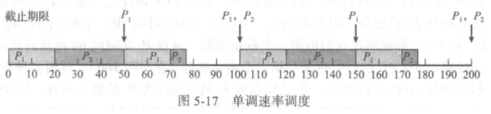
      - 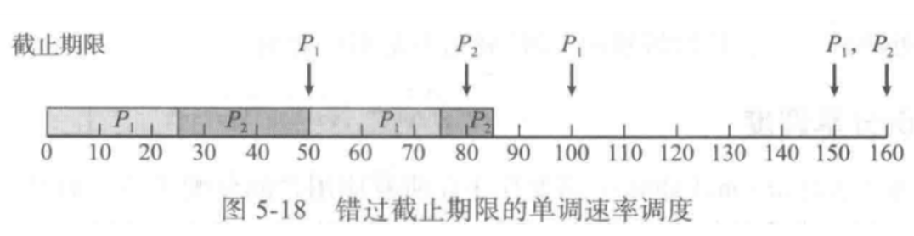
<br>

- **最早截止期限优先调度**
  - <u> 核心规则：**任务的截止期限越早 ---> 优先级越高** </u>
  - 并且：<u> **优先级动态调整，运行时会根据截止期限实时变化**（动态优先级）。</u>
  - 最早截止期限优先(EDF, Earliest-Deadline-First)调度算法采用**抢占的**、**动态优先级**的策略，可调度周期性/非周期性任务。
  - 调度时会实时比较所有可运行进程的截止期限，截止期限更早的进程可随时抢占当前运行的进程。
  - 调度策略：根据进程的截止期限动态分配优先级，截止期限越早优先级越高；进程变为可运行时需向系统声明自身截止期限，系统会据此重新调整优先级。
    - 逐句拆解分析：
      - 「动态分配优先级」= 优先级不是固定的，会随任务截止期限变化
        举例：
        - 任务 P1：当前截止期限 100
        - 任务 P2：当前截止期限 80
        此时 P2 优先级更高，哪怕 P1 周期更短也会被 P2 抢占。
      - 为什么要按截止期限定优先级？
        理由：
        - 实时系统的核心目标是**满足截止期限**，而非单纯看任务频率；
        - 谁的截止期限更近，谁就更紧急，必须优先执行避免超时；
        - 动态调整能灵活应对任务执行顺序变化，最大化利用CPU。
      - 核心逻辑：EDF 的设计思想是「谁的 deadline 更近，谁就优先」，优先级实时变动，这是和 RMS 最本质的区别。
      - 适用前提解读：EDF 不要求任务是周期性的，也不要求每次处理时间固定，只需任务就绪时声明截止期限即可，适用场景更广。
  - 与**RMS调度**的核心**区别**（对比）
    - | 对比维度 | 单调速率调度(RMS) | 最早截止期限优先(EDF) |
      | --- | --- | --- |
      | 优先级类型 | 静态优先级（固定不变） | 动态优先级（实时调整） |
      | 优先级依据 | 任务周期（周期越短优先级越高） | 任务截止期限（越早到优先级越高） |
      | 任务要求 | 必须是周期性、处理时间固定 | 无强制要求，周期/非周期均可 |
      | CPU利用率上限 | 理论最高≈69.3% | 理论可达100% |
  - 经典实例分析（RMS失败但EDF成功）
    - 任务参数：P1（周期p1=50，处理时间t1=25），P2（周期p2=80，处理时间t2=35）
    - 调度时间线+核心分析：
      1. 初始阶段：P1截止期限更早，优先级更高，先运行至25时刻结束；
      2. 25~50时刻：P2开始运行，50时刻P1新周期到来；
      3. 关键区别：RMS会让P1抢占P2，但EDF比较截止期限→P2截止80早于P1的100，**P2继续运行**；
      4. P2在60时刻前完成，P1在60~85运行，均满足各自截止期限；
      5. 后续周期同理，动态调整优先级，所有任务均不超时。
    - 核心结论：RMS因静态优先级导致抢占不合理而超时，EDF靠动态优先级灵活调度，成功满足截止期限。
  - <u> **CPU利用率特点** </u>
    - **理论上限**
      - EDF 是**理论最优**的实时调度算法，CPU利用率**可达到100%**；
      - 只要任务总利用率≤100%，EDF 就能保证所有进程满足截止期限。
    - **实际限制**
      - 实际使用中无法达到100%利用率，受**上下文切换开销**、**中断处理代价**影响；
      - 系统调度本身需要消耗资源，过高负载会导致调度延迟增大。
  - EDF 的**优缺点**
    - **优点**
      - 理论最优，CPU利用率可接近100%，资源利用更充分；
      - 适用范围广，支持周期性、非周期性任务，不要求处理时间固定；
      - 动态优先级调度，应对复杂任务场景的能力远强于RMS；
      - 能调度RMS无法满足的任务组合，容错性更强。
    - **缺点**
      - 调度开销更大，需实时计算、调整优先级，运行时成本高于RMS；
      - 实现更复杂，系统设计难度高于静态优先级的RMS；
      - 高负载下上下文切换频繁，可能影响系统稳定性；
      - 实际无法达到理论100%的利用率，存在性能损耗。
  - 例图
    - 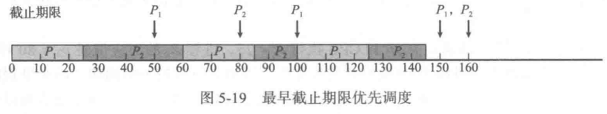
<br>

- **比例分享调度**
  - <u> 核心规则：**按持股比例分配CPU时间，持股占比 = 获得的处理器时间占比** </u>
  - 比例分享（proportional share）调度属于**公平共享型调度**，不关注优先级/截止时间，核心是按预设份额均分CPU资源。
  - 调度策略：将CPU总处理时间划分为固定的T股，为每个进程分配N股，进程最终获得的CPU时间比例严格等于 `N/T`。
    - 逐句拆解分析：
      - 「按股分配」本质：把CPU总时间当成可拆分的“股份”，分发给不同进程
        核心逻辑：持股数量直接决定CPU使用份额，比例固定、不随意变动
      - 这种分配方式的意义：
        - 保证进程拿到**稳定、固定比例**的CPU资源，不会被其他进程挤占；
        - 避免出现进程饥饿，每个进程都有明确的资源保障；
        - 适合需要稳定带宽/算力的场景（如视频播放、虚拟化、流媒体）。
  - 核心保障机制：**准入控制策略**
    - 规则：只有新进程请求的股数 ≤ 系统剩余可用股数时，才允许该进程进入系统
    - 作用：从源头避免总股数超额，确保所有已运行进程都能足额拿到预设的CPU比例，不会出现分配失效。
  - 实例分析
    - 总股数 T = 100
    - 进程A：50股 → 占用**50%** CPU时间
    - 进程B：15股 → 占用**15%** CPU时间
    - 进程C：20股 → 占用**20%** CPU时间
    - 剩余可用股数：100 - (50+15+20) = **15股**
    - 新进程D请求30股：30 ＞ 15，准入控制器直接拒绝D进入，保证原有进程分配不受影响。
  - 比例分享调度的**优缺点**
    - 优点
      - 资源分配公平、可预测，严格按比例分配，无进程饥饿；
      - 准入控制机制可靠，不会出现超额分配导致调度失效；
      - 实现简单，调度逻辑直观，适合对资源配额有固定要求的场景；
      - 能稳定保障各进程的最低资源需求。
    - 缺点
      - 不考虑实时性、截止期限，**不适用于硬实时系统**；
      - 股数需提前分配，灵活性差，无法适配突发任务；
      - 准入控制会直接拒绝新进程，可能影响新任务执行；
      - 只保证比例公平，不追求CPU总利用率最大化。

- 总结表格
  - | 对比维度         | 单调速率调度（RMS）                 | 最早截止期限优先（EDF）            | 比例分享调度                     |
    |------------------|------------------------------------|------------------------------------|----------------------------------|
    | 调度依据         | **任务周期**（周期越短优先级越高）  | **截止期限**（截止越早优先级越高）  | **持股比例**（持股越多时间越多）  |
    | 优先级类型       | **静态优先级（固定不变）**          | **动态优先级（运行中实时调整）**    | **无优先级**，按比例分配         |
    | CPU 利用率       | 最高约 **69.3%**                   | 理论可达 **100%**                  | 按配额分配，不追求最大化         |
    | 适用任务类型     | **周期性、处理时间固定**            | **周期性/非周期性均可**            | 无限制，注重资源配额             |
    | 核心目标         | **保证硬实时任务不超时**            | **满足截止期限+充分利用 CPU**       | **保证资源分配公平，避免饥饿**   |
    | 调度方式         | **抢占式**                         | **抢占式**                         | 多按时间片轮转，非抢占为主       |
    | 准入/保障机制    | 利用率上限判断                     | 无固定准入，动态调度保障           | **严格准入控制**，总股数不可超额 |
    | 典型应用场景     | **简单嵌入式硬实时系统**            | **复杂实时系统**                   | **虚拟化、流媒体、固定资源配额场景** |

# 第六章 同步
- 引入
  - **协作进程**能与系统内的其他执行进程相互影响。协作进程或能直接共享逻辑地址空间（即代码和数据），或能通过文件或消息来共享数据。而**共享数据的并发访问可能导致数据的不一致**。
  - 本章讨论多种机制，以便确保共享同一逻辑地址空的协作进程的有序进行，从而维护数据的一致性。
- **未完待续喵 ~** 
